# Town Of Impostors

<a href="https://discord.gg/xpsKVpUf4T"><p align="center"></a>
<a href="https://twitter.com/itsAJMix"></p></a>

<p align="center">We now have a discord server! Join the discord server: https://discord.gg/xpsKVpUf4T</p>
<p align="center">Follow me on twitter: https://twitter.com/itsAJMix</p>

<p align="center">Town Of Impostors Mod is a modification for Among Us - <b>PC/Windows (Steam)</b>. This mod aims to add new roles, modifiers & abilities to enhance gameplay, while also providing a full range of options to allow for customising and playing games your way.</p>

<p align="center"><b>Every player in the room must have the mod installed for it to work correctly. Please DO NOT play this mod on public lobbies, it is intended for private organised lobbies.</b></p>

<p align="center">
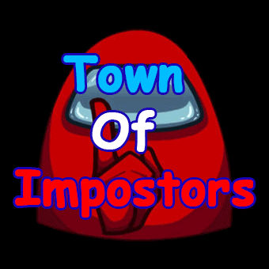
</p>

<p align="center">


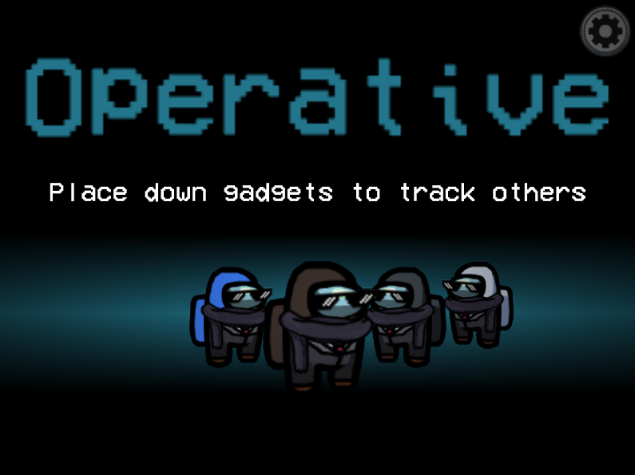
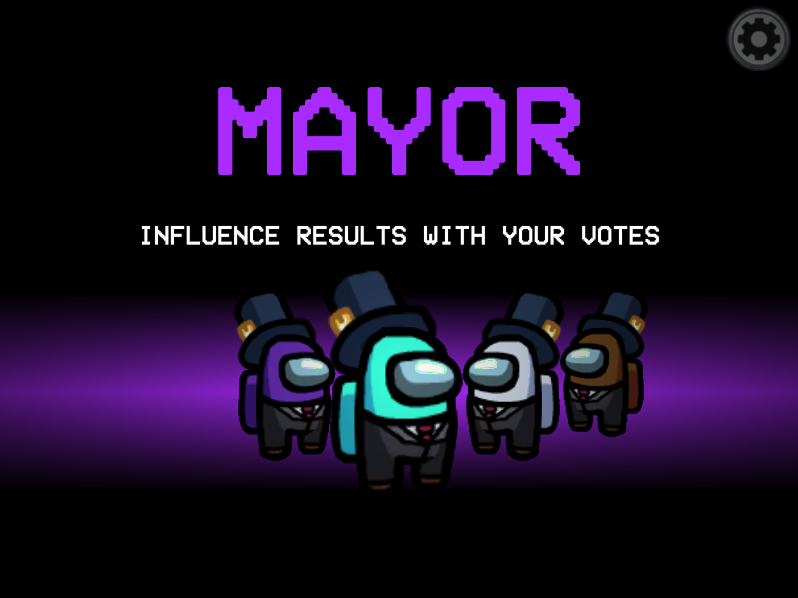
</p>

---

<p align="center">

 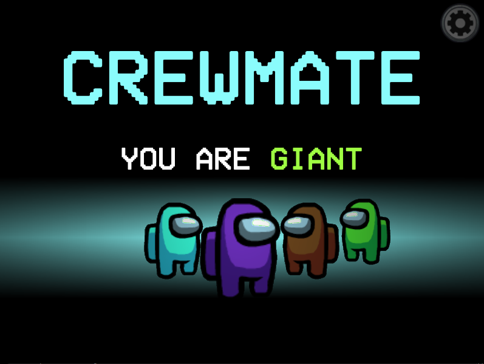
 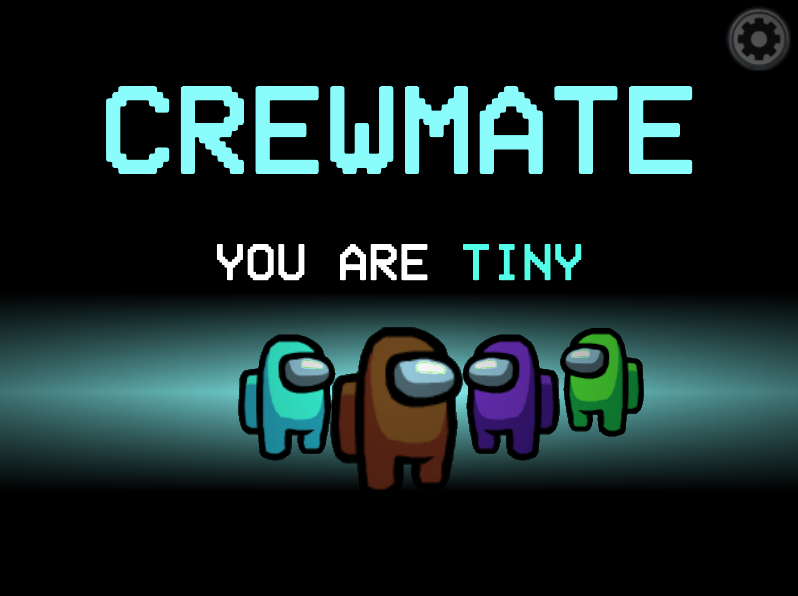
 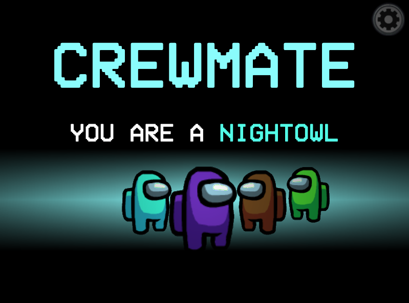
</p>

---

<p align="center">
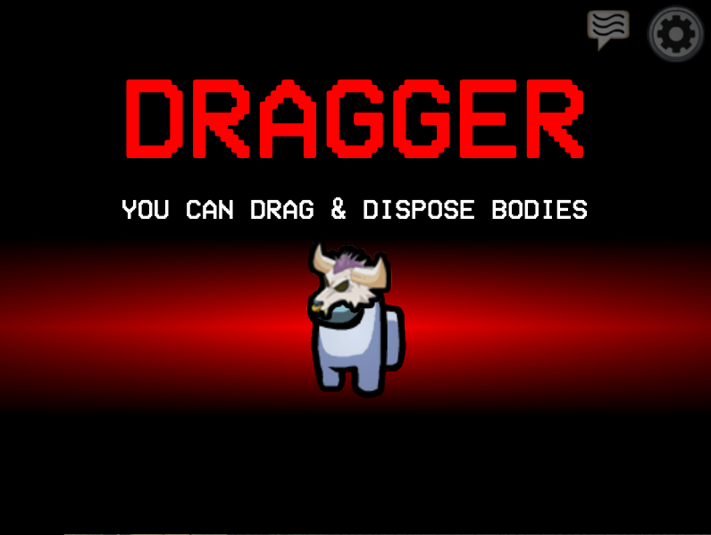
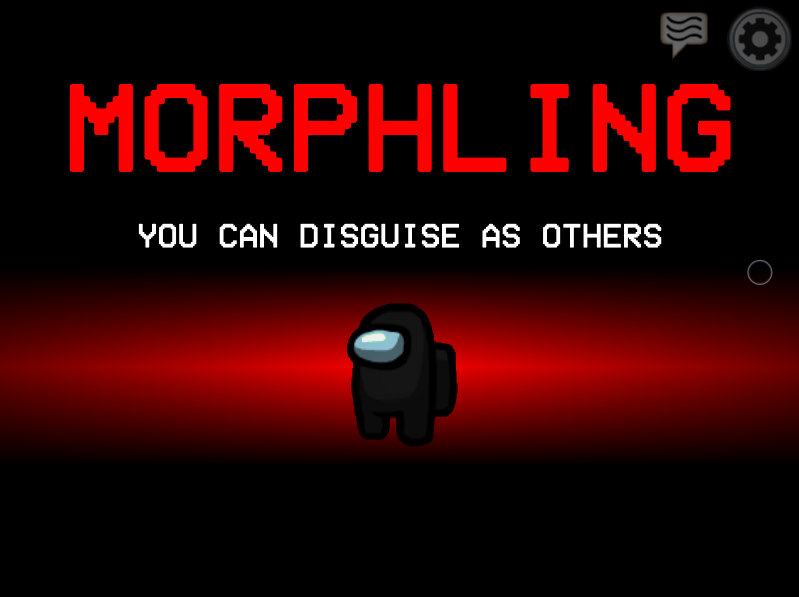
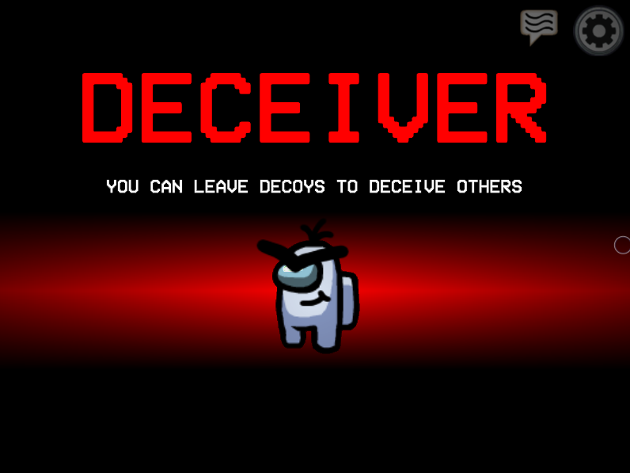
 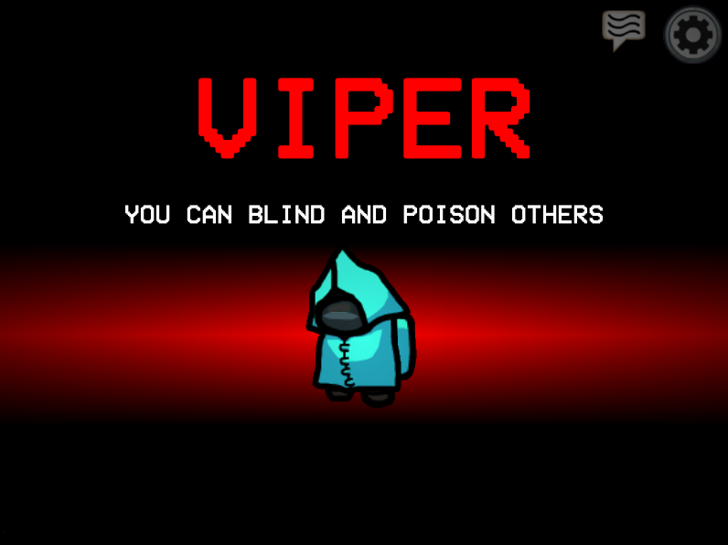
 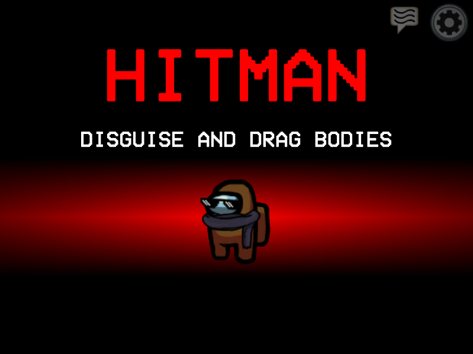
 
 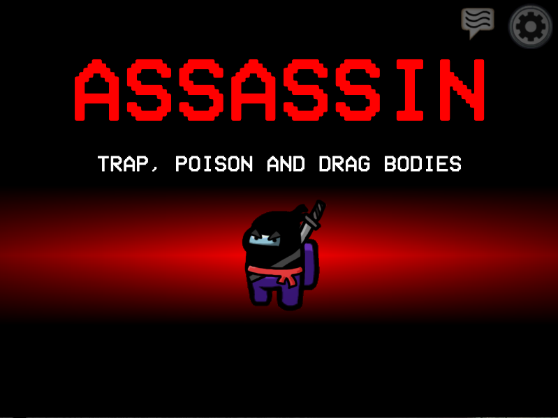
 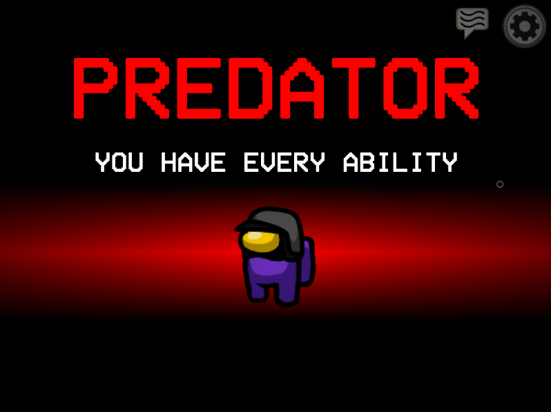
 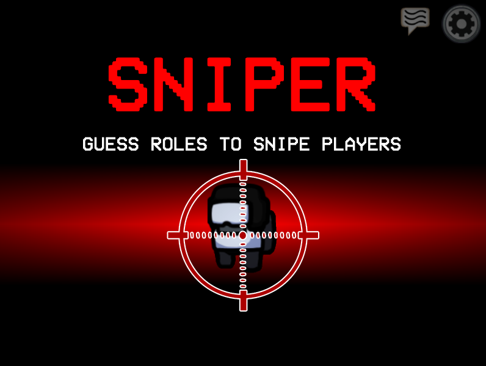
</p>

---

Table of Contents
=================
  * [Installation](#installation)
    * [Releases and Compatibility](#releases-and-compatibility)
    * [Saving and Loading Settings](#saving-and-loading)
    * [Uninstalling](#uninstalling-the-mod)
    * [Updating](#updating-the-mod)
  * [Custom Hats](#customhats)
    * [Modifiers](#modifiers)
    * [Advanced Modifiers](#advanced-modifiers)
  * [Custom Colors](#customcolors)
  * [Streamer Mode](#streamermode)
  * [Roles, Abilities, Modifiers & Custom Options](#roles-abilities-modifiers--custom-options)
    * [Crewmate Team](#crewmate-team)
      * [Sheriff](#sheriff)
      * [Doctor](#doctor)
      * [Agent](#agent)
      * [Detective](#detective)
      * [Plumber](#plumber)
      * [Informant](#informant)
      * [Trickster](#trickster)
      * [Operative](#operative)
      * [Mayor](#mayor)
    * [Other Teams](#other-teams)
      * [Jester](#jester)
      * [Arsonist](#arsonist)
      * [Impostor](#impostor-team)
    * [Modifiers](#modifiers)
      * [Lovers](#lovers)
      * [Giant](#giant)
      * [Tiny](#tiny)
      * [Nightowl](#nightowl)
    * [How Role Assignment Works](#how-does-role-assignment-work)
  * [FAQ](#faq)
  * [Troubleshooting](#troubleshooting)
    * [Known Issues](#known-issues)
  * [Contact & Donations](#contact--donations)
  * [Credits](#credits)
  * [License](#license)

---

<h1 id="installation">Installation</h1>

- If you are updating your Town Of Impostors version, please hop to this section [here](#updating-the-mod).

- Before installing, verify your Among Us version by launching the game and checking the version displayed in the top left of the main menu.

- As of the Among Us v2021.3.31.3s update, **you must sign in to your account and set your player name now** to avoid issues later such as setting your name or typing in the chat in the modded game.

- Download the Mod for your specific game version from the table below or check all releases [here](https://github.com/AJMix/TownOfImpostors/releases). **ENSURE THAT YOUR AMONG US VERSION MATCHES EXACTLY - EVERY DIGIT, LETTER, DOT & ALL.**

- Make a copy of your clean, unmodded game’s root directory `Steam/steamapps/common/Among Us` and rename the copied directory to whatever you want e.g. `Steam/steamapps/common/Among Us Town Of Impostors`. This copied directory is what will be modded. You can get to your root directory by right-clicking Among Us in Steam -> Properties -> Local Files -> Browse. **RECOMMENDED STEP TO KEEP SEPARATE COPIES IN CASE YOUR MODDED GAME BREAKS & TO AVOID AN AUTO-UPDATE BREAKING THE MOD.**

- Extract the contents `TownOfImpostors.zip` into the copied folder you created.

- Ensure the copied directory that is being modded now contains at least the following:
```
.
├── Among Us_Data
├── BepInEx <---
├── mono <---
├── Among Us.exe
├── baselib.dll
├── doorstop_config.ini <---
├── GameAssembly.dll
├── steam_appid.txt <---
├── UnityCrashHandler32.exe
├── UnityPlayer.dll
└── winhttp.dll <---
```
<details>
 <summary>Still unsure? Click this for an image of what it should look like if you have hidden file name extensions</summary>
 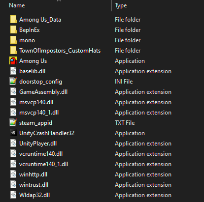
 </details>
 
- **Make sure to launch the game via the Among Us.exe from this directory**. Please note that the first time launching the game with this mod may take a while - give it one minute before worrying that nothing is appearing.

**Verifying installation success**
- Launching the game via Among Us.exe
- In the top-left corner of the main menu, below the Among Us version, you should see _Town Of Impostors vX.X.X Mod by AJMix_ to indicate the mod is running and has been successfully installed.

If you don't see this message or have any other issues, please take a look at the <a href="#troubleshooting">troubleshooting section</a>.


**Version Mismatch Checker:**
- Starting from v1.8.1 onwards, there is now a version mismatch checker that'll make sure that all users in the lobby are using the same game version. If a red message appears on the top right stating **"Warning: Player Version Mismatch"**, then there's a potential that someone in the lobby is not using the correct version.
- Sometimes this warning message can appear when something strange occurs, even if all users in the lobby are using the same version. If you're 100% sure all users in the lobby are using the same mod version, simply have players rejoin the lobby.

_Before raising an issue, please double check that you have accurately followed the installation instructions and you are not using any mod manager or other mods._

_Starting from v1.5.0 onwards, there is a new reset custom settings button in the lobby. Please use it if your settings are bugged. Settings can bug when you update from version to version, it's best practice to reset settings._

_Starting from v1.6.0 onwards, this mod should now be compatible with Mod Manager by MatuxGG. Please note that using the Mod Manager to install the mod still does not guarantee that the mod will work as intended._

### Saving and Loading
Starting from v1.8.1, you can now save and load your settings. This is to help lower the issue of settings completely messing up between versions. You should find a new `TownOfImpostorsSettings.txt` in the Among Us folder where the mod is installed. This can also be passed onto others so they can play with your settings!

From v1.8.6 onwards, there are now 5 **Save & Load** slots. You can use these to save multiple settings. You will be able to find them as `TownOfImpostorsSettings_1.txt`, `TownOfImpostorsSettings_2.txt` etc. inside of the `TownOfImpostors_Data` folder. Please launch the game or create the folder yourself if you don't see it. These settings can be passed onto others. If you were using the previous `TownOfImpostorsSettings.txt` before, please move this into the folder and rename it to `TownOfImpostorsSettings_1.txt`.

### Uninstalling the Mod
- If you copied the Among Us folder as instructed by the Installation Steps, simply delete the copied folder.
- If you did not, and you unzipped the mod into your main Among Us folder, then you have to delete the following folders & files:
  - **BepInEx** folder, **mono** folder, **doorstop_config.ini**, **winhttp.dll**
 
<h2>Releases and Compatibility</h2>

<table style="width:100%">
  <tr>
    <th>Among Us Version</th>
    <th>Mod Version</th>
    <th>Link</th>
  </tr>
 <tr>
    <td>v2021.6.15s</td>
    <td>v2.0.7</td>
    <td><a href="https://github.com/AJMix/TownOfImpostors/releases/download/v2.0.7/TownOfImpostors2.0.7.zip">Download</></td></td>
   </tr>
 <tr>
 <tr>
    <td>v2021.5.25s & v2021.5.25e</td>
    <td>v2.0.6</td>
    <td><a href="https://github.com/AJMix/TownOfImpostors/releases/download/v2.0.6/TownOfImpostors2.0.6.zip">Download</></td></td>
   </tr>
 <tr>
    <td>v2021.5.10s</td>
    <td>v2.0.5</td>
    <td><a href="https://github.com/AJMix/TownOfImpostors/releases/download/v2.0.5/TownOfImpostors2.0.5.zip">Download</></td></td>
   </tr>
 <tr>
 <tr>
    <td>v2021.5.10s</td>
    <td>v2.0.3</td>
    <td><a href="https://github.com/AJMix/TownOfImpostors/releases/download/v2.0.3/TownOfImpostors2.0.3.zip">Download</></td></td>
   </tr>
 <tr>
 <tr>
    <td>v2021.5.10s</td>
    <td>v2.0.1</td>
    <td><a href="https://github.com/AJMix/TownOfImpostors/releases/download/v2.0.1/TownOfImpostors2.0.1.zip">Download</></td></td>
   </tr>
 <tr>
    <td>v2021.4.12s & v2021.4.14s</td>
    <td>v2.0.0</td>
    <td><a href="https://github.com/AJMix/TownOfImpostors/releases/download/v2.0.0/TownOfImpostors2.0.0.zip">Download</></td></td>
   </tr>
 <tr>
 <tr>
    <td>v2021.4.12s & v2021.4.14s</td>
    <td>v1.9.2</td>
    <td><a href="https://github.com/AJMix/TownOfImpostors/releases/download/v1.9.2/TownOfImpostors1.9.2.zip">Download</></td>
   </tr>
 <tr>
 <tr>
    <td>v2021.4.12s & v2021.4.14s</td>
    <td>v1.8.6.1</td>
    <td><a href="https://github.com/AJMix/TownOfImpostors/releases/download/v1.8.6.1/TownOfImpostors1.8.6.1.zip">Download</></td>
   </tr>
 <tr>
    <td>v2021.4.12s & v2021.4.14s</td>
    <td>v1.8.6</td>
    <td><strike>Download</strike></></td>
   </tr>
  <tr>
 <tr>
    <td>v2021.4.12s & v2021.4.14s</td>
    <td>v1.8.2.1</td>
    <td><a href="https://github.com/AJMix/TownOfImpostors/releases/download/v1.8.2.1/TownOfImpostors1.8.2.1.zip">Download</></td>
   </tr>
  <tr>
    <td>v2021.3.31.3s</td>
    <td>v1.8.1</td>
    <td><a href="https://github.com/AJMix/TownOfImpostors/releases/download/v1.8.1/TownOfImpostors1.8.1.zip">Download</></td>
   </tr>
  <tr>
    <td>v2021.3.31.3s</td>
    <td>v1.7.1</td>
    <td><a href="https://github.com/AJMix/TownOfImpostors/releases/download/v1.7.1/TownOfImpostors1.7.1.zip">Download</></td>
   </tr>
  <tr>
  <tr>
    <td>v2021.3.31.3s</td>
    <td>v1.7.0</td>
    <td><a href="https://github.com/AJMix/TownOfImpostors/releases/download/v1.7.0/TownOfImpostors1.7.0.zip">Download</></td>
   </tr>
  <tr>
  <tr>
    <td>v2021.3.5s</td>
    <td>v1.6.1</td>
    <td><a href="https://github.com/AJMix/TownOfImpostors/releases/download/v1.6.1/TownOfImpostors1.6.1.zip">Download</></td>
   </tr>
  <tr>
    <td>v2021.3.5s</td>
    <td>v1.6.0</td>
    <td><a href="https://github.com/AJMix/TownOfImpostors/releases/download/v1.6.0/TownOfImpostors1.6.0.zip">Download</></td>
   </tr>
   <tr>
    <td>v2021.3.5s</td>
    <td>v1.5.0</td>
    <td><a href="https://github.com/AJMix/TownOfImpostors/releases/download/v1.5.0/TownOfImpostors1.5.0.zip">Download</></td>
   </tr>
    <tr>
    <td>v2021.3.5s</td>
    <td>v1.4.0</td>
    <td><a href="https://github.com/AJMix/TownOfImpostors/releases/download/v1.4.0/TownOfImpostors1.4.0.zip">Download</></td>
  </tr>
    <tr>
    <td>v2021.3.5s</td>
    <td>v1.3.0</td>
    <td><a href="https://github.com/AJMix/TownOfImpostors/releases/download/v1.3.0/TownOfImpostors1.3.0.zip">Download</></td>
  </tr>
    <tr>
    <td>v2020.12.9s</td>
    <td>v1.2.0</td>
    <td><a href="https://github.com/AJMix/TownOfImpostors/releases/download/v1.2.0/TownOfImpostors1.2.0.zip">Download</></td>
  </tr>
   <tr>
    <td>v2020.12.9s</td>
    <td>v1.1.0</td>
    <td><a href="https://github.com/AJMix/TownOfImpostors/releases/download/v1.1.0/TownOfImpostors1.1.0.zip">Download</></td>
  </tr>
  <tr>
    <td>v2020.12.9s</td>
    <td>v1.0.0</td>
    <td><a href="https://github.com/AJMix/TownOfImpostors/releases/download/v1.0.0/TownOfImpostors1.0.0.zip">Download</></td>
  </tr>
</table>

<details>
  <summary>Changelog</summary>
 <details>
  <summary>v2.0.7</summary>
  <h3>v2.0.7</h3>
   <ul>
    <li>Compatibility with v2021.6.15s of Among Us</li>
    <li>Various small bug fixes</li>
   </ul>
  <summary>v2.0.6</summary>
  <h3>v2.0.6</h3>
   <ul>
    <li>Fixed bug with custom hat system</li>
<li>Fixed issue with meetings not ending correctly with sniping/poison</li>
<li>Fixed issue with Tiny/Giant modifier kills leading to players going into walls</li>
<li>Added more custom hats</li>
   </ul>
    </details>
 <details>
  <summary>v2.0.5</summary>
  <h3>v2.0.5</h3>
   <ul>
    <li>Fixed and optimised bugs regarding custom options</li>
<li>Further optimised custom button system</li>
<li>Sniper reveal arrow duration can now be set to 0 (so it doesn't appear at all)</li>
<li>dded extra safety checks to Hat System to prevent everything breaking</li>
<li>Fixed speed issues with Tiny</li>
<li>Fixed Tiny not being able to do some tasks</li>
<li>Fixed HidePlayerModel still hiding players on comms sabotage anonymity</li>
<li>Fixed exploit that allowed people to go through walls when morphing into Giant/Tiny</li>
<li>[Balance Change] Comms Anonymous Sabotage now also updates player scale to take into account Giant/Tiny modifiers for consistency</li>
   </ul>
    </details>
 <details>
  <summary>v2.0.3</summary>
  <h3>v2.0.3</h3>
   <ul>
    <li>Morphing fix</li>
   </ul>
    </details>
 <details>
  <summary>v2.0.1</summary>
  <h3>v2.0.1</h3>
   <ul>
<li>New Home Update Button, Easier Updating Of Mod</li>
<li>Fixed Sniper Kill Button exploit</li>
<li>Fixed vote not ending if Sniper dies</li>
<li>Fixed Sniper guess text not displaying properly</li>
<li>Lobby Host Buttons should now appear for new host when previous host leaves</li>
<li>Custom Color txt and Settings txt are now renamed to backup files</li>
   </ul>
    </details>
  <details>
  <summary>v2.0.0</summary>
  <h3>v2.0.0</h3>
   <ul>
<li>Sniper Role (Unique Impostor Role)</li>
<li>Hat System 2.0 (Animated Hats, More Possibilities)</li>
<li>Dead Players Seeing All Roles now also see Lover Icons</li>
<li>Art updates by Con No 1 (Twitter @Con_No_1)</li>
<li>Giant Modifier, Tiny Modifier, Nightowl Modifier</li>
<li>Impostors can now see poisoned players in meetings</li>
<li>[Custom Option] Speed Modifier % for dragging bodies</li>
<li>[Custom Option] Poison Continues In Meeting</li>
<li>Fixed a bug with venting with Plumber & Jester</li>
<li>Fixed bug with blind traps not being disabled when toggle off</li>
<li>Fixed bug with sabotages not ending game in some cases with All Crewmates Must Die Mode On</li>
<li>Fixed Jester Footprints not disappearing on death</li>
<li>Fixed bug with revived Informants losing role and seeing everyone as their own name</li>
<li>Fixed bug with Poison Kills on Decoys not properly setting cooldown</li>
<li>Fixed exploit allowing Impostors to reset cooldown after poison ability</li>
   </ul>
    </details>
 <details>
  <summary>v1.9.2</summary>
  <h3>v1.9.2</h3>
   <ul>
<li>Settings 2.0</li>
<li>[Custom Option] Enable Impostor Abilities (only if Impostor Roles are off)</li>
    <li>[Custom Option] Mayor Cannot Be Lover</li>
<li>ALL MUST DIE Gamemode (Impostors only win if ALL crewmates are dead)</li>
<li>Impostor Blind Trap Ability</li>
<li>Impostor Poison Ability</li>
<li>Detective Body Scan Ability</li>
<li>Detective Body Report shows whether victim was poisoned</li>
<li>Impostor Viper Role (Tier 1)</li>
<li>Impostor Assassin Role (Tier 2)</li>
<li>Impostor Predator Role (Tier 3)</li>
<li>New warning for when settings are bugged (messed up values)</li>
<li>Added foolproof checks to prevent errors in custom colors, settings and hats from stopping the mod from loading</li>
<li>Using chat (between meetings) no longer freezes kill cooldown, this should encourage more Impostor Comms/Lover chat</li>
<li>Jester can see their own footprints if paint ability toggled on</li>
<li>Game Continues With Arsonist is now a "Gamemode"</li>
<li>Mayor Hats will no longer show in meeting hud if player is dead</li>
<li>Fixed bug with ghosts still having issues with vision</li>
<li>Arsonist douse time now defaults to 2 seconds</li>
<li>Detective Anonymous Footprints defaults off, footprint time default 15 seconds</li>
<li>Fixed bug with uninteractable bodies</li>
<li>Fixed exploit that allowed Doctors to revive & report someone at the same time</li>
<li>Fixed bug with Arsonist dousing players in vents</li>
<li>QoL update, hats tab mentions hat pages</li>
<li>Progress Bar QoL update</li>
<li>Fixed small bug with loaded settings not synced between players</li>
<li>Various small bug fixes</li>
<li>Even more optimisations for even smoother performance</li>
   </ul>
    </details>
  <details>
  <summary>v1.8.6.1</summary>
  <h3>v1.8.6.1</h3>
   <ul>
<li>Fixed major game breaking bugs with voting</li>
<li>Fixed issue with bodies disappearing if player dies while dragging a body through vent</li>
<li>Fixed potential issues with trickster disguised decoy</li>
    <li>Various small bug fixes and optimisations</li>
   </ul>
    </details>
 <details>
  <summary>v1.8.6</summary>
  <h3>v1.8.6</h3>
   <ul>
<li>Mayor Role</li>
<li>Map Randomisation Game Mode</li>
<li>Brought back "dlekS ehT" map</li>
<li>Hat Pages to store more custom hats</li>
<li>Arsonist can now douse players in vents</li>
<li>Optional hat name modifiers for hats to display better in menu _<xOffset>_<yOffset> (example _0.0f_0.1f)</li>
<li>Sheriff kill timer will start at 10 seconds, matching Impostors</li>
<li>Impostors inside of vents can now kill Plumbers & Jesters inside of vents</li>
<li>Moved "Can Vent With Body" to General Options</li>
<li>Trickster Disguise Ability</li>
<li>Hitman & Joker Impostor Roles</li>
<li>Fixed bug associated with disguise & start meeting</li>
<li>Fixed color name bug</li>
<li>Fixed Impostors setting names as red in messages even with Impostors Do Not Know Each Other option</li>
<li>Fixed desyncs with dispose body</li>
<li>Fixed Streamer Mode</li>
<li>Implemented Host Checks for Sheriff & Impostor kills to prevent kill desyncs (this will introduce host advantage and delay to kills if you're not the host, but this fixes all desyncs on kills)</li>
<li>Fixed gamebreaking bugs with impostors kills</li>
<li>Fixed bug with lover death not removing disguise</li>
<li>Compatibilities with Reactor & Reactor.Essentials</li>
<li>Impostor Retrieve Body Ability</li>
<li>Plumber Retrieve Body Ability</li>
<li>Doctor Retrieve Body Ability</li>
<li>Jester Retrieve Body Ability</li>
<li>[Custom Option] Vents Hold Multiple Bodies</li>
<li>[Custom Option] Imps Can Kill Inside Vents</li>
<li>Massive optimisations</li>
<li>Various other null ref and bug fixes</li>
   </ul>
    </details>
 <details>
  <summary>v1.8.2.1</summary>
  <h3>v1.8.2.1</h3>
   <ul>
    <li>Separate Impostor roles (Dragger, Morphling, Deceiver)</li>
    <li>Custom Hats can now match Crewmate color with _anycolor modifier</li>
    <li>More custom hats from community</li>
    <li>Fixed issue with Lover getting stuck in Airship</li>
     <li>Name fixes (fixed issue with host role being revealed sometimes)</li>
     <li>Fixed issues with colours of certain hats messing up in ladder climb in airship</li>
     <li>Fixed issues with people seeing Lover's chat</li>
     <li>Bug fixes and polishes</li>
     <li>[Custom Option] Dead Player See All Roles</li>
     <li>[Custom Option] Sheriff Does Not Die</li>
     <li>[Custom Option] Imps Do Not Know Each Other</li>
   </ul>
    </details>
 <details>
  <summary>v1.8.1</summary>
  <h3>v1.8.1</h3>
   <ul>
    <li>Bunch of awesome custom hats from the community</li>
    <li>Operative Role</li>
    <li>More colours to select from</li>
    <li>Improved Naming/Role, colorblind-friendly</li>
     <li>Save/Load Settings Button In Lobby</li>
     <li>Fixed game breaking bugs with custom colours</li>
     <li>Fixed Text: Lovers Wins -> Lovers Win</li>
     <li>Fixed specific hats not working with Decoys</li>
     <li>Impostors can now use destroy decoy, disguise and dispose body again in vents (Sorry for breaking this before)</li>
     <li>Fixed an issue with "Impostors Can Kill Each Other" somehow causing infinite disguise</li>
     <li>Fixed a small issue with some hats & disguise</li>
     <li>Fixed issue with agent cams ability broken on airship</li>
     <li>Fixed an issue with arsonist continuing douse even while dead</li>
    <li>Fixed sabotage comms anonymity not working on decoys</li>
    <li>Fixed an issue where player's hats would appear for a frame while anonymous when climbing ladders/performing a kill</li>
    <li>[Custom Option] Jester Bloody Footprints</li>
    <li>[Custom Option] Jester Body Drag</li>
    <li>[Custom Option] Jester Can Use Vents</li>
   </ul>
    </details>
 <details>
  <summary>v1.7.1</summary>
  <h3>v1.7.1</h3>
   <ul>
    <li>Compatibility with 2021.3.31.3s</li>
    <li>CUSTOM HATS! (See instructions on how this works at the top)</li>
    <li>Streamer Mode (See instructions on how this works at the top)</li>
    <li>Fixed role selection not properly randomising player list (host always got a role no matter what)</li>
     <li>Bloodstains on vents should now properly disappear after meetings</li>
     <li>Detective footprints now properly disappear after they lose their role from revives)</li>
     <li>Fixed ghost crewmate vision that broke in the latest version</li>
     <li>Made Informant arrows bigger</li>
     <li>Fixed issue with disguise revealing impostors before meetings</li>
     <li>Fixed role description text not appearing properly</li>
     <li>Fixed a bug that caused infinite duration for some abilities</li>
     <li>Fixed agent abilities being broken in some maps</li>
     <li>[Modifier] Lover Modifier</li>
    <li>[Custom Option] Disguised Footprints: Toggles whether Disguised Impostors leave Disguised Footprints</li>
    <li>[Custom Option] Agent Abilities Share Cooldown: Toggles whether all Agent abilities should go into cooldown when using one ability</li>
    <li>[Custom Option] Game Continues With Arsonist: Toggles whether the game continues if Arsonist is still alive</li>
    <li>[Custom Option] Disable Body Report: Toggles whether body reports are enabled or not</li>
   </ul>
    </details>
  <details>
  <summary>v1.7.0</summary>
  <h3>v1.7.0</h3>
   <ul>
    <li>Compatibility with 2021.3.31.3s</li>
    <li>Compatibilities with Airship</li>
    <li>Trickster Role</li>
    <li>Impostor Decoy Abilities (Like Trickster)</li>
     <li>Lobby Role Summary for Chances and Count</li>
     <li>Lobby Improvements (Role Bookmarks)</li>
     <li>Colorblind Friendly Updates</li>
     <li>Fixed bugs with Impostor Comms</li>
     <li>Dousing & Reviving now show progress bars instead</li>
     <li>Fixed bugs with dead bodies using wrong colours on Comms Sabotage</li>
     <li>Fixed some buttons resetting CDs on opening windows</li>
     <li>Fixed issue with toggle buttons blocking scrolling/clickable anywhere (don't know why Innersloth made it like this)</li>
     <li>Various bug fixes & optimisations</li>
   </ul>
    </details>
  <details>
  <summary>v1.6.1</summary>
  <h3>v1.6.1</h3>
   <ul>
    <li>Fixed issue with DLL plugin no longer working</li>
    <li>Disguise issues with Meetings and KillOverlay fixed</li>
    <li>Fixed revived players losing "Douse" state</li>
    <li>Fixed hotkeys still working while other windows are opened</li>
     <li>Fixed abilities being able to be used while doing other things</li>
   </ul>
    </details>
  <details>
  <summary>v1.6.0</summary>
  <h3>v1.6.0</h3>
   <ul>
    <li>Informant role</li>
    <li>Doctor Medbay only fix for Polus</li>
    <li>DNA Sample button improved</li>
    <li>Mod Manager (by MatuxGG)/Reactor.Essentials compatibility</li>
    <li>Fixed disguising-pet-vent bug</li>
    <li>Custom Option: Crewmate Ghosts Use Crewmate Vision</li>
    <li>Percentage Chance for Roles</li>
    <li>New 1,2,3,4.. Keybinds for Abilities</li>
     <li>Arsonist better end visuals</li>
     <li>Custom Option for killers to leave bloody footprints for detective</li>
     <li>Custom Option to allow Impostors to kill each other</li>
     <li>Custom Option for Arsonist to refuel</li>
     <li>Custom Option for Jester to win from Sheriff Kill</li>
     <li>Custom Option for Doctor Revive to remove Crewmate special role</li>
     <li>Custom Option to change whether Impostor can vent with body or not</li>
     <li>Custom Option for Doctor Revive Time</li>
     <li>Fixed bug with Detective seeing Impostor colour footprints despite being disguised</li>
     <li>Fixed bug with Pets reappearing during comms sabotage after meeting</li>
     <li>Fixed bug with buttons being used in meetings</li>
     <li>Balance Fix: Custom Buttons cooldowns no longer continue going down during meetings</li>
     <li>Removed CUSTOM server option (please look into Unify by MoltenMods)</li>
     <li>Various null fixes</li>
     <li>Optimisations</li>
   </ul>
    </details>
  <details>
  <summary>v1.5.0</summary>
  <h3>v1.5.0</h3>
   <ul>
    <li>Impostor Drag & Drop Body Ability toggle</li>
    <li>Arsonist Role</li>
    <li>Plumber Role</li>
    <li>Detective Role</li>
    <li>Doctor Drag & Drop Body Ability</li>
    <li>Doctor Option: Medbay revives only</li>
    <li>Impostor Comms</li>
    <li>Comms sabotage causes anonymity</li>
     <li>Jester Victory Screen Fix</li>
     <li>Dead bodies won't play kill animation on vent exit</li>
     <li>You can now sample DNA from dead bodies</li>
     <li>Fake tasks for Jester & Arsonist</li>
     <li>Role description in task list</li>
     <li>Reset custom settings button in lobby</li>
     <li>Updated role selection process</li>
     <li>Dispose Bodies leave bloodsplat</li>
     <li>Button bug fixes</li>
     <li>Anonymous Votes resetting fix</li>
     <li>Various null fixes</li>
     <li>Optimisations</li>
   </ul>
    </details>
  <details>
  <summary>v1.4.0</summary>
  <h3>v1.4.0</h3>
   <ul>
    <li>Agent Role</li>
    <li>Fixed settings resetting bug</li>
    <li>Added CUSTOM server option</li>
    <li>Sheriff custom kill button sprite</li>
    <li>Option for same roles to know each other</li>
    <li>Option for Sheriff to kill non-impostors</li>
    <li>Sheriff Kill CD changes</li>
    <li>Various null fixes</li>
   </ul>
  </details>
  <details>
  <summary>v1.3.0</summary>
    <h3>v1.3.0</h3>
   <ul>
    <li>Compatibility with v2021.3.5s</li>
    <li>Updated custom options to be more clean & clear</li>
    <li>New ability to cycle through options HUD display</li>
    <li>Jester role</li>
    <li>Fixed issue with Sheriff being able to kill through walls</li>
    <li>Fixed detection through walls for other abilities</li>
    <li>Fixed issue with dragging body sometimes not rendering on top of ground</li>
    <li>Various null fixes</li>
   </ul>
  </details>
  <details>
  <summary>v1.2.0</summary>
  <h3>v1.2.0</h3>
   <ul>
    <li>Fixed Sheriff being able to kill Impostor in vent</li>
    <li>Disguise should now work properly with pets</li>
    <li>Several other null bugs</li>
   </ul>
  </details>
  <details>
  <summary>v1.1.0</summary>
  <h3>v1.1.0</h3>
   <ul>
    <li>Fixed taskbar not updating and removing "you are dead" line when revived</li>
    <li>Fixed bug with Sheriff not being able to kill Impostor</li>
    <li>Several nullpointer bugfixes</li>
   </ul>
  </details>
</details>
 
### Updating the Mod
It is recommended to keep separate folders for each version of Town Of Impostors instead of overwriting, even if the Among Us version between them is the same and it appears that the bundled files are the same in each release. But if you're intent on updating an existing version of the mod with a new version that is compatible to that version of Among Us: 

- Please ensure you **extract and overwrite all** that has been asked. Do not pick and mix, or extract only the `TownOfImpostors.dll` for updating. Each release was crafted for the BepInEx it is bundled with, so there will be errors if the wrong version of BepInEx is used.

- We've begun labelling the mod with `TownOfImpostors-X.X.X.dll` to help differentiate between the versions under file explorers, so you may not receive a confirmation to overwrite the mod itself. Whilst this should not cause any issues as BepInEx checks and uses the latest version of a mod, if there are any problems, please proceed to `\Among Us Modded\BepInEx\plugins\` and delete the older versions of the mod.

- Inside your `\Among Us Modded\BepInEx\`, please delete the `\cache\` folder.

- You may have to sign in again to your account. If it does not work inside the modded game, please launch the unmodded version and sign in through there first before returning to the modded game. This is why we recommend copying and working with a copied directory of Among Us that is not auto-updated by Steam but also a backup for any issues involving modding.

- In the lobby, please click Reset Settings on the bottom left when playing a new version of Town Of Impostors. See [Known Issues](#known-issues) for why. If you're running v1.8.1 or higher, you may use the Save Settings before the update, then Load Settings after the update to restore your Town Of Impostors configuration.

- Now hope all is good! If there are errors, you can always resort to a fresh installation of the mod with another copy of the unmodded Among Us folder!   

<h2>Curseforge</h2>
You can download the mod on Curseforge <a href="https://www.curseforge.com/among-us/all-mods/town-of-impostors">here</a>.

---

<h1 id="customhats">Custom Hats</h1>

**Only for versions v1.7.1 onwards**

## How do I add my own Custom Hat?

### New System:
* Download the **new** template, along with the default empty manifest.json to being making Custom Hats for Town Of Impostors (you may still use the old template if you want to) **Massive thanks to JonyKasual for working hard to create an advanced template**
  * Download an empty `manifest.json` [here](https://github.com/AJMix/TownOfImpostors/releases/download/v2.0.0/manifest.json)
  * Download .psd template 150x185 [here](https://github.com/AJMix/TownOfImpostors/releases/download/v2.0.0/ToI_CustomHat_Template_150x185_v2.psd)
  * Download .psd template 225x280 [here](https://github.com/AJMix/TownOfImpostors/releases/download/v2.0.0/ToIHat_AdvancedTemplate_225x280.psd)
  * Download .psd template 300x370 [here](https://github.com/AJMix/TownOfImpostors/releases/download/v2.0.0/ToIHat_AdvancedTemplate_300x370.psd)
  * Download .png template for Idle (150x185) [here](https://github.com/AJMix/TownOfImpostors/releases/download/v2.0.0/ToI_CustomHat_Template_150x185_Idle_v2.png)
  * Download .png template for Climbing (150x185) [here](https://github.com/AJMix/TownOfImpostors/releases/download/v2.0.0/ToI_CustomHat_Template_150x185_Climbing_v2.png) 
* Draw your hat on the template and save in PNG format, with a unique name (make sure to also hide the crewmate and shadow). Preserve the resolution.

* With the new system, you will be able to create hats for all layers (Front, Back, Climbing) and have to all compiled into one, as long as it is all specified in the manifest.json. You will also be able to create animated hats, and specify other parameters such as hat bounce, adaptive color and whether to hide crewmate.
* To get animated hats, set the animated parameter in the manifest.json to `true` and add to the list of Front, Back or Climb images
* Please leave `PivotPoint` and `PixelsPerUnit` as default values if you don't know how they work
* You may use any name for the folder and files as long as everything is specified correctly in the manifest.json, but for the folder it is recommended to use the naming convention `<hat name>_<creator name>` for clarity
* Submit your entire hat bundle as a `.zip` file in the discord
* Please see the `ExampleHat_AJMix` bundled in the build for an example of how the new system works
* If the new system is too complicated, you may always continue using the **Old System**

### Old System:
* Download the template used to make the Custom Hat for Town Of Impostors **(Big Thanks to Con No 1 for the template)**:
  * Download .psd template [here](https://github.com/AJMix/TownOfImpostors/releases/download/v1.8.2.1/ConTemplate.psd)
  * Download .png template [here](https://github.com/AJMix/TownOfImpostors/releases/download/v1.8.2.1/ConTemplate.png)
* Draw your hat on the template and save in PNG format, with a unique name (make sure to also hide the crewmate and shadow). Preserve the resolution.
  
* **IMPORTANT:** Please follow this naming convention `<HatName>_<Credits>_<Modifiers>` for your PNG. See below for list of modifiers. If you want spaces in your names, use `-` to represent spaces. For example, `Bouncy-Hat` will be processed into `Bouncy Hat` inside the game.

**Example Names:** `Wing_Spaced-AJMix_back.png`, `Bouncy-Hat_AJMix_bounce.png`, `BouncyWings_AJMix_back_bounce.png`, `Simple-Hat_AJMix.png`, `Advanced-Hat_AJMix_bounce_anycolor_-1.1f_+2.3f.png`

* Place the custom hat png into the `TownOfImpostors_CustomHats` which can be found inside of the Among Us directory you have the mod installed (launch the game once and start a lobby with the mod or create the folder yourself if it does not exist)

* Your custom hat should now appear in the hats tab **locally**. If you want everyone to see the same thing **make sure everyone has the same hats in the custom hats folder.**

---

### Modifiers
*All hat modifiers are **case sensitive**!*


`_back`
> If you want your hat to be behind the crewmate (i.e. wings). 

`_bounce`
> If you want it to bounce while the crewmate walks.

`_anycolor`
> **From v1.8.2 onwards**, you'll be able to also add this as an additional modifier to have your hat match the colour of your crewmate. You'll need to use **Red** _(Hex: FF0000)_ for the base colour, and **Blue** _(Hex: 0000FF)_ for the shading. See example of how this is done here: 

  

### Advanced Modifiers
*All hat modifiers are **case sensitive**!*


`_0.0f_0.0f`  
> **From v1.8.6 onwards**, you can now add **X** and **Y** offsets to the name to position the hat more accurately in the menu i.e. `Simple-Hat_AJMix_-0.5f_+0.3f`. You need to specify both an **X** and a **Y** offset. Placing a **+** or **-** in front will indicate whether it should be positive or negative. _Placing no symbols will default it to positive._ The offsets must follow the exact example as shown, with a decimal number followed by an _"**f**"_.

## Want to add your hat as part of the mod so everyone can use it?
* Simply follow the same steps above to create a Custom Hat, please join the discord server and post your hat in the custom hat channel there so it can be ready to add in the next release. Please also follow the naming convention so I know the hat name, credits and whether you'd like it to be added to the **back** of the crewmate and whether you'd like it to **bounce**.
* The Hat Name and Credits will be grabbed from the file name, as long as you have followed the naming convention. When someone wears your hat, credits will appear underneath the mod credits! (i.e. `AJ Scarf by AJMix`, `Dark Scarf by Darkbrussel`)
* I'll try my best to get your Custom Hat into the next release of Town Of Impostors!

## Where can I download more custom hats from the community?
Please join the discord to find more custom hats from the community, as well as download links!

---

<h1 id="customcolors">Custom Colors</h1>

**From v1.8.6 onwards**, you will be able to add your own custom colors.

Add your custom colors to the file `TownOfImpostors_CustomColors.txt` which can be found in the `TownOfImpostors_Data` folder. Please launch the game and create a lobby once if you don't see the folder or file, or manually create them yourselves. 

Follow this example to add a color:
> `255,255,255,255 220,220,220,255 Pure_White PWH`

Each part of the entry stands for this:
> `MainColor` `ShadingColor` `LongName` `ShortName`
> 
> For the colors the format is: R,G,B,A (values between 0-255)
> 
> Separate each part with a space, use `_` to represent spaces in the long name.

**In multiplayer, everyone must have the same `TownOfImpostors_CustomColors.txt` to see and use the same custom colors!**

---

<h1 id="streamermode">Streamer Mode</h1>

**From v1.7.1 onwards**, there is a new streamer mode that can be toggled on.

This makes it easier for streamers as they won't have to manually hide the code anymore on stream, it will be hidden automatically.

### How do I get the room code?
When you create a room, the room code will be copied to your clipboard. Simply paste it somewhere and pass it onto others.

If you accidentally copied something else before pasting the room code somewhere, you can get your copy/clipboard history by using `Windows Key + V`. Or you can just make another room.

---

# Roles, Abilities, Modifiers & Custom Options

### Keybindings
From 1.6.0 onwards, you can now use keys **1, 2, 3, 4, Z, X** to activate abilities.

### Gamemodes
- **Map Randomise Mode:** When toggled on, map will be randomised upon starting the game
- **All Crewmates Must Die Mode:** When toggled on, game will continue as long as a crewmate is alive (special win conditions still occur for Jester, Arsonist and Lovers)
- **Game Continues With Arsonist:** Toggles whether the game should continue as long as Arsonist is alive

### Extra Settings
- **Custom Role Eject Confirmation:** Enables ejects to show the special role of the player being ejected, assuming "Confirm Ejects" option is on
- **Same Roles Know Each Other:** Allows players of the same role to see each other (via highlighted names)
- **Comms Sabotage Causes Anonymity:** Improves the Comms Sabotage to turn everyone anonymous
- **Ghosts Use Crewmate Vision:** Ghosts will no longer have ghost vision (where they can see everything), they will now instead use normal crewmate vision. Impostors are unaffected. _This option is recommended if there is a Doctor in the game_
- **Disable Body Report:** Toggles on/off body reporting (to get a different kind of gameplay)
- **Dead Player See All Roles:** Toggles whether dead players should see all roles (after a meeting only)
- **Can Vent With Body:** Toggle whether players can vent with bodies
- **% Boddy Drag Speed Modifier:** % Movement Modifier for dragging bodies

## Crewmate Team

The special roles in the Crewmate Team. The goal of the Crewmate Team is to combine their abilities and knowledge to **find the Impostors**. The Crewmate Team will win if all Impostors are ejected or killed.

### Sheriff
The Sheriff is a role that has the ability to kill Impostors. However, if they attempt to kill a fellow crewmate, they will lose their own life instead as a punishment.
<details>
<summary>Custom Options</summary>
  
+ **% Sheriff Chance:** Chance of a Sheriff being added to the role selection pool
+ **# Max Sheriff Count:** The maximum number of Sheriffs that can be added to the role selection pool
+ **Sheriff Kill Cooldown:** Kill cooldown for the Sheriff
+ **Show Sheriff:** Shows the Sheriff to other players (via a highlighted name)
+ **Innocent Target Also Dies:** The Innocent target will also be killed along with the Sheriff
+ **Jester Is Enemy:** Jester will no longer count as "Innocent"
+ **Arsonist Is Enemy:** Arsonist will no longer count as "Innocent"
+ **Sheriff Does Not Die:** Toggles whether Sheriff will die as a punishment or not

</details>

### Doctor
The Doctor is a role that has the ability to revive dead players. However, this means they are also able to revive Impostors that have been killed by the Sheriff.
<details>
<summary>Custom Options</summary>
  
+ **% Doctor Chance:** Chance of a Doctor being added to the role selection pool
+ **# Max Doctor Count:** The maximum number of Doctors that can be added to the role selection pool
+ **Doctor Revive Cooldown:** Cooldown for the Doctor Revive Ability
+ **Doctor Revive Time:** The time is takes for a Doctor to successfully revive a player
+ **Start Cooldown On Failed Revives:** Start Revive Ability Cooldown if revive fails (if body is removed or disposed)
+ **Medbay Revive Only:** Only allow revives in the Medbay location of a map
+ **Lose Role On Revive:** Crewmates with special roles lose their role if revived (Does not affect Jester & Arsonist)
+ **Retrieve Body Ability:** Toggle the Retrieve Body Ability
+ **Retreive Body Cooldown:** Cooldown for the Retrieve Body Ability

</details>

### Agent
The Agent is a powerful role that has abilities allowing them to access map intel from anywhere. This includes the admin table map, security cameras, door logs and vitals if any are accessible. This gives them much more information on what is going on around the map, but they shouldn't neglect their tasks either.
<details>
<summary>Custom Options</summary>
  
+ **% Agent Chance:** Chance of a Agent being added to the role selection pool
+ **# Max Agent Count:** The maximum number of Agents that can be added to the role selection pool
+ **Agent Tech Cooldown:** The cooldown of Agent's abilities (the cooldowns are separate between the abilities, but they will all have the same cooldown time)
+ **Can Use Admin Map:** Agent can activate Admin Map
+ **Can Use Cameras:** Agent can activate Cameras _(Skeld and Polus Only)_
+ **Can Use Door Logs:** Agent can activate Door Logs _(MIRA HQ Only)_
+ **Can Use Vitals:** Agent can activate Vitals _(Polus Only)_
+ **Agent Abilities Share Cooldown:** Toggle whether all agent abilities go into cooldown after using one ability

</details>

### Detective
The Detective is a role that can see footprints and get extra information when reporting bodies (They will get a body report in chat only they can see, which shows time of death and if the body was moved or not). They should use this ability to track down Impostors, but they should also be careful not to frame the wrong person.
<details>
<summary>Custom Options</summary>
  
+ **% Detective Chance:** Chance of a Detective being added to the role selection pool
+ **# Max Detective Count:** The maximum number of Detectives that can be added to the role selection pool
+ **Enable Body Scan Ability:** Toggles body scan ability for Detective
+ **Body Scan Cooldown:** Body scan ability cooldown
+ **Body Scan Radius:** Body scan radius
+ **Footprint Duration:** How long the footprints will last in seconds
+ **Anonymous Footprints:** Whether the footprints should be anonymous or not
+ **Extra Information On Report:** If Detective reports a body, they will get an additional "Body Report" via messages (which only they can see). Shows how long the player has been dead for, as well as whether the body has been moved or not. Also shows whether the body was poisoned.
+ **Killers Leave Bloody Prints:** Killers _(includes both Sheriffs & Impostors)_ will leave bloody footprints after a kill
+ **Bloody Prints Duration:** Duration for how long Killers should have bloody footprints
+ **Disguised Footprints:** Toggles whether Impostors leave behind disguised footprints if they are disguised

</details>

### Plumber
The Plumber is a role that can use vents to travel around. They can also stay in vents to observe the room. But they should be careful not to be suspected as the Impostor or noticed by the Impostor.
<details>
<summary>Custom Options</summary>
  
+ **% Plumber Chance:** Chance of a Plumber being added to the role selection pool
+ **# Max Plumber Count:** The maximum number of Plumbers that can be added to the role selection pool
+ **Retrieve Body Ability:** Toggle the Retrieve Body Ability
+ **Retreive Body Cooldown:** Cooldown for the Retrieve Body Ability

</details>

### Informant
The Informant is a role that can see other roles after they are finished with ALL their tasks. They will be "Informed" after finishing tasks, but should also be careful of Impostors that are notified about them. The Informant can only be informed or revealed after **completing at least one task**.

**NOTE: Comms Anonymous Sabotage (if toggled on) will prevent Informant from seeing roles, even in meetings. This is the counterplay to Informant.**

<details>
<summary>Custom Options</summary>
  
+ **% Informant Chance:** Chance of a Informant being added to the role selection pool
+ **# Max Informant Count:** The maximum number of Informants that can be added to the role selection pool
+ **Impostors Are Notified:** Toggles whether Impostors will be notified and also have the Informant revealed to them
+ **Tasks Left When Impostors Notified:** How many tasks left for the Informant before Impostors are notified about them
+ **Show Arrows (Informants And Impostors):** Show arrows pointing to Informants/Impostors if either have been revealed. These can only be seen by Informants or Impostors depending on options that are enabled
+ **See Jester After Tasks:** Toggles whether Informants can see Jesters after tasks
+ **See Arsonists After Tasks:** Toggles whether Informants can see Arsonists after tasks
+ **See Crewmate Roles After Tasks:** Toggles whether Informants can see Crewmate special roles _(if any)_ after tasks
+ **Highlight Names In Meetings:** Toggles whether names are highlighted in meetings too _(for Informants & Impostors)_

</details>

### Trickster
The Trickster is a role that can create a decoy to trick the Impostor. If the Impostor kills the decoy, they will go into kill cooldown which will slow them down. However, the Sheriff is also able to kill decoys. The Trickster may also swap positions with their decoys to avoid danger or cover more ground quicker.
<details>
<summary>Custom Options</summary>
  
+ **% Trickster Chance:** Chance of a Trickster being added to the role selection pool
+ **# Max Trickster Count:** The maximum number of Tricksters that can be added to the role selection pool
+ **Trickster Decoy Cooldown:** Cooldown duration for the Trickster Decoy ability
+ **Trickster Decoy Duration:** Duration of how long the decoy should last
+ **Enable Trickster Swap Ability:** Allow Trickster to swap positions with the decoy
+ **Trickster Swap Cooldown:** Cooldown duration for the Trickster Swap ability
+ **Trickster Disguise Ability:** Toggles whether triggers can disguise as other players
+ **Trickster Disguise Cooldown:** Cooldown for Trickster disguise
+ **Trickster Disguise Duration:** Duration for Trickster's disguise

</details>

### Operative
The Operative is a role that can place down gadgets that allow them to track other players. A sticky tracker can be placed down that'll stick to other players and reveal them for the duration. An AOE sensor can be placed down to reveal players in an area (revealed players will be anonymous) for a duration. **All revealed players will be shown on the map.** The Operative gadgets are only visible to the Operative.
<details>
<summary>Custom Options</summary>
  
+ **% Operative Chance:** Chance of an Operative being added to the role selection pool
+ **# Max Operative Count:** The maximum number of Operatives that can be added to the role selection pool
+ **# Max Tracker Storage:** Maximum number of trackers that can be stored
+ **Tracker Duration:** How long Trackers should last before disappearing
+ **Tracker Cooldown:** Cooldown to gain a tracker charge
+ **# Max Sensor Storage:** Maximum number of sensors that can be stored
+ **Sensor Radius:** Size of the sensor radius for revealing players
+ **Sensor Duration:** How long Sensors should last before disappearing
+ **Sensor Cooldown:** Cooldown to gain a sensor charge
+ **Show Tracking Arrows:** Toggle whether the tracker should also show a tracking arrow when tracking someone
+ **Track Dead Bodies:** Toggle whether trackers/sensors should continue tracking dead players

</details>

### Mayor
The Mayor is a role that gets additional votes they can use to influence the results of a meeting. They are able to store votes each meeting and can add votes to any player in the meeting (or skip vote) at any time, as long as they have not locked in their final vote. They should use this if they want to force someone to be voted out or force a skip vote. But they should be careful not to reveal themselves too early.

<details>
<summary>Custom Options</summary>
  
+ **% Mayor Chance:** Chance of a Mayor being added to the role selection pool
+ **Enable Mayor:** Toggle whether Mayor is enabled or not
+ **Mayor Cannot Be Lover:** Toggles whether a Mayor can be lover or not
+ **Starting Vote Bank:** How many votes should Mayor start with
+ **Votes Gained Per Meeting:** How many votes Mayor should gain per meeting
+ **Enable Emergency Ability:** Toggle Mayor's Emergency Meeting Ability
+ **Emergency Ability Cooldown:** Mayor Emergency Meeting Ability cooldown
+ **Emergency Ability Limit:** Maximum number of times Mayor can use the ability

</details>

## Neutral Team

### Jester
The Jester is a role with no abilities and no tasks to do (they get fake tasks like Impostors). They are in their own team, and their goal is to get themselves ejected from the ship and make sure not to get killed by the Impostors. They will win instantly if ejected from the ship. However, if they are killed, they will have no way to win and essentially lose. The have extra abilities to help them act suspicious, such as dragging bodies, leaving bloody footprints and using vents.
<details>
<summary>Custom Options</summary>
  
+ **% Jester Chance:** Chance of a Jester being added to the role selection pool
+ **Enable Jester:** Allow Jester to be added to the role selection pool 
+ **Jester Can Fix Sabotages:** Allow Jester to fix sabotages
+ **Jester Wins From Sheriff Kill:** Jester will win if killed by the Sheriff
+ **Jester Bloody Footprints Ability:** Toggles whether the Jester can leave bloody footprints to trick the detective
+ **Jester Body Drag Ability:** Toggles whether the Jester can drag bodies
+ **Jester Can Use Vents:** Toggles whether the Jester can use vents
+ **Retrieve Body Ability:** Toggle the Retrieve Body Ability
+ **Retreive Body Cooldown:** Cooldown for the Retrieve Body Ability

</details>

### Arsonist
The Arsonist is a role that aims to douse everyone alive and igniting them all to win alone. They need to do this before the Crewmate Team wins by finding all the Impostors. They have no tasks (they get fake tasks like Impostors), but should be careful not to be suspected as they have to say close for the duration of time they are dousing. They should also be careful not to be killed by the Impostor.
<details>
<summary>Custom Options</summary>
  
+ **% Arsonist Chance:** Chance of a Arsonist being added to the role selection pool
+ **Enable Arsonist:** Allow Arsonist to be added to the role selection pool 
+ **Douse Time:** How long it takes for Arsonist to douse a target
+ **Arsonist Can Fix Sabotages:** Toggles whether Arsonists can fix sabotages
+ **Arsonist Must Refuel:** Toggles whether Arsonists must refuel after set amount of douses
+ **# Douses Stored:** Number of successful Douses before Arsonists must refuel _(if refuel option is toggled on)_

</details>

## Impostor Team

### New Abilities:
- Drag & Drop Bodies - The Impostor may now drag & drop bodies to reposition them, bodies may also be dragged through vents
- Dispose Body - The Impostor can dispose a body they are dragging, if they are close to or inside a vent. A bloodstain is left behind to give crewmates a clue
- Disguise/Sample DNA - The Impostor can disguise as another player, by first sampling their DNA
- Decoy - The Impostor can drop a decoy, much like the Trickster, and can drop decoys of other players by first disguising as them
- Swap - The Impostor can swap positions with their decoy
- Blind Trap - The Impostor can leave blind traps that will blind players that walk on it
- Poison - The Impostor can poison a player, they will die after a set duration

### Impostor Settings

<details>
  
<summary>Custom Options</summary>
  
+ **Enable Impostor Roles:** Enable separate Impostor roles. If this is toggled off, the Impostor is a "Super Impostor" with all abilities
+ **Enable Impostor Abilities:** This option is available is Impostor Roles is toggled off. Enables/Disables abilities for the normal Impostor
+ **Impostors Can Kill Each Other:** Allows Impostors to target and kill each other
+ **Impostors Do Not Know Each Other:** Toggles whether Impostors know each other
+ **Impostors Can Kill Inside Vents:** Toggles whether Impostors can kill any other players inside of vents (if they are in the vent too)
+ **Enable Impostor Messaging:** Toggle on/off Impostor Comms. Impostor Comms allows Impostors to chat to each other in-game via the chat messaging system, outside of meetings

</details>

### Dragger
The Dragger is an Impostor role that can drag & drop dead bodies. They are also able to dispose the dead bodies in vents.

<details>
<summary>Custom Options</summary>
  
+ **% Dragger Chance:** Chance of a Dragger being added to the role selection pool
+ **Dragger Count:** The maximum number of Draggers that can be added to the role selection pool
+ **Drag And Drop Ability:** Toggle the Drag and Drop Ability
+ **Dispose Body Ability:** Toggle the Dispose Body Ability
+ **Dispose Body Cooldown:** Cooldown for the Dispose Body Ability
+ **Retrieve Body Ability:** Toggle the Retrieve Body Ability
+ **Retreive Body Cooldown:** Cooldown for the Retrieve Body Ability
+ **Vents Hold Multiple Bodies:** Toggles whether multiple bodies can be disposed in one vent (default is 1 body maximum if toggled off)

</details>

### Morphling
The Morphling is an Impostor role that can sample DNA of other players and disguise into them, confusing everyone.

<details>
<summary>Custom Options</summary>
  
+ **% Morphling Chance:** Chance of a Morphling being added to the role selection pool
+ **Morphling Count:** The maximum number of Morphlings that can be added to the role selection pool
+ **Disguise Ability:** Toggle the Disguise Ability
+ **Disguise Cooldown:** Cooldown for the Disguise Ability
+ **Disguise Duration:** How long the Disguise lasts for in seconds

</details>

### Deceiver
The Deceiver is an Impostor role that can leave decoys and swap to them, confusing players and allowing them to reposition themselves.

<details>
<summary>Custom Options</summary>
  
+ **% Deceiver Chance:** Chance of a Deceiver being added to the role selection pool
+ **Deceiver Count:** The maximum number of Deceivers that can be added to the role selection pool
+ **Enable Decoy Ability:** Toggle the Decoy Ability for Impostors
+ **Decoy Cooldown:** Cooldown for the Decoy ability
+ **Decoy Duration:** Duration for how long the Decoy will last
+ **Enable Decoy Swap Ability:** Toggle the Decoy Swap Ability for Impostors
+ **Decoy Swap Cooldown:** Cooldown for the Decoy Swap Ability

</details>

### Viper
The Viper is an Impostor role that can blind and poison other players.

<details>
<summary>Custom Options</summary>
  
+ **% Viper Chance:** Chance of a Viper being added to the role selection pool
+ **Viper Count:** The maximum number of Vipers that can be added to the role selection pool
+ **Blind Trap Ability:** Toggle the blind trap ability
+ **Blind Trap Charges:** Max charges of blind traps Viper can hold
+ **Blind Trap Cooldown:** Blind trap cooldown to regain a charge
+ **Blind Trap Duration:** How long the blind trap should last
+ **Blind Duration:** How long players are blinded for
+ **Poison Ability:** Toggle the poison ability
+ **Poison Duration:** Duration before player is killed by poison
+ **Poison Additional Kill Cooldown:** How much extra cooldown is added to the kill button
+ **Poison Cure Duration:** How long it takes to cure the poison in medbay
+ **Poison Continues In Meeting:** Toggles whether Poison Timer should continue ticking in meetings

</details>

</details>

### Sniper
The Sniper has the ability to kill players during meetings if they are able to guess their roles. But they may be punished for wrong guesses. They may also use a Sniper in-game if toggled on. (Note: Sniper Rotation is not synced between players, so you will not see where the player is aiming)

**REMINDER:** Toggling on the Sniper Rifle will hide/replace the original Kill Button

<details>
<summary>Custom Options</summary>
  
+ **% Sniper Chance:** Chance of a Sniper being added to the role selection pool
+ **Sniper Count:** The maximum number of Snipers that can be added to the role selection pool
+ **Max Snipe Per Meeting:** The number of times the Sniper can attempt to kill players in meetings with role guesses
+ **Sniper Dies On Wrong Guess:** Punish the Sniper with death if they guess wrong
+ **Sniper Rifle Ability:** Toggled On/Off the Sniper Rifle to use between meetings, a long range killing ability _**(NOTE: This hides/replaces the normal kill)**_
+ **Sniper Rifle Cooldown:** Cooldown for Sniper Rifle Shots
+ **Rifle Unholster Cooldown:** Cooldown to unholster the Sniper Rifle
+ **Rifle Holster Cooldown:** Cooldown to holster the Sniper Rifle
+ **Gunshot Revealed Duration:** Duration for how the Sniper Shot Reveal Arrow lasts

</details>

**If seperate Impostor Roles are disabled, the normal Impostors will use all abilities (configured with the same custom options as the separate roles). Basically every Impostor is a "Predator"**

## If separate Impostor Roles are enabled:
### Tier 1 Impostors:
- **Dragger** has the drag/drop & dispose body abilities
- **Morphling** has the sample & disguise abilities
- **Deceiver** has the decoy & swap abilities
- **Viper** has the blind trap & poison abilities

### Tier 2 Impostors:
- **Hitman** has the combined abilities of Dragger and Morphling
- **Joker** has the combined abilities of Morphling and Deceiver
- **Assassin** has the combined abilities of Dragger and Viper

### Tier 3 Impostors:
- **Predator** has the abilities of all Impostor roles

**Any Impostor without a special Impostor role will be a normal vanilla Impostor with no abilities. Impostor Role abilities are configured with the same options used to configure the normal Impostor**

## Modifiers

### Lovers
This activates the Lovers modifier. Two players are selected as random to be lovers (if applicable). Impostors can also be selected as Lovers. Jesters & Arsonists cannot be selected as Lovers. There can not be more than 1 Impostor Lover.

Lovers can still get their own special roles, and can still win as normal with their respective teams.

However, the Lovers can achieve a special "Lovers Win". The goal of the Lovers is to stay alive together and win together at the end. Lovers will achieve the special Lovers Win if they are both among the **last 3 players** standing. The only exception to this is if the custom option **Game Continues With Arsonist** is toggled on and the Arsonist is among the last 3. The game will continue as long as the Arsonist is alive.

Lovers are given the ability to chat with each other via a special Lovers Chat in-between meetings.

<details>
<summary>Custom Options</summary>
  
+ **% Lovers Chance:** Chance for Lovers to appear
+ **Enable Lovers:** Toggles Lovers on/off
+ **Lovers Die Together:** Toggles whether Lovers should die together (if one dies, the other dies, like a life link)

</details>

### Giant
This activates the Giant modifier. A Giant player will have a larger sight radius to see more things, but will suffer from slower movement speed.

<details>
<summary>Custom Options</summary>
  
+ **% Giant Chance:** Chance for Giant to appear
+ **Enable Giant:** Toggles Giant on/off
+ **% Movement Modifier:** Percentage movement modifier for Giant
+ **% Vision Modifier:** Percentage vision modifier for Giant

</details>

### Tiny
This activates the Tiny modifier. A Tiny player will be able to move around faster, but will suffer from lower vision (opposite of Giant)

<details>
<summary>Custom Options</summary>
  
+ **% Tiny Chance:** Chance for Tiny to appear
+ **Enable Tiny:** Toggles Tiny on/off
+ **% Movement Modifier:** Percentage movement modifier for Tiny
+ **% Vision Modifier:** Percentage vision modifier for Tiny

</details>

### Nightowl
This activates the Nightowl modifier. A Nightowl will be able to see better when lights are out compared to other players, but will suffer from worse vision when lights are on.

<details>
<summary>Custom Options</summary>
  
+ **% Nightowl Chance:** Chance for Nightowl to appear
+ **Enable Nightowl:** Toggles Nightowl on/off
+ **% Lights On Vision Modifier:** Percentage Lights On Vision modifier for Nightowl
+ **% Lights Off Vision Modifier:** Percentage Lights Off Vision modifier for Nightowl

</details>

# How does role assignment work?
The role selection works as follows:
For each role, it will attempt to add that to the selection pool **X** number of times, where **X** is the maximum count. The chance of the role being added to the selection pool each time is based on the percentage chance set in the custom options for the specified role.

Once the selection pool is filled, the roles in there will then be randomly assigned to Crewmates (who are not already Impostors and don't already have a special role). As long as there are roles in the pool to assign and Crewmates to assign them to, they will be assigned out. If there are no more roles to be assigned out, the remaining players will just stay as normal Crewmates.

Example:
_**Sheriffs - # Max Count: 3 | % Chance: 50**_

This means that the role selection will try to put 3 sheriffs into the pool, at 50% chance each time. So the pool can end up with 0, 1, 2 or even the maximum of 3 Sheriffs.

---

# FAQ
 
### Can you play Proximity Chat (Crewlink) with it?
Yes, Crewlink supports Among Us Modifications

### Can this mod work with other mods?
I cannot guarantee that this mod will work with other mods. There will likely be conflicts. You will have to test yourself. 

### Do my friends need to install the mod to play it together?
Yes. Every player in the lobby must have the mod installed. Please don't use and play mods in unorganised public lobbies.

### Can you get banned for playing on public servers?
At the current state of the game there is no perma ban system, though this may change depending on the stance of the Among Us developers. The mod is designed in a way that it does not send prohibited server requests. In a public lobby with randoms, with only you having the mod installed, you would either be kicked for strange behaviour or have a desync between you and other users that do not have the same mods, or both. In short, as long as this mod is played among friends in your own private lobby, you're safe.

If you are really worried, I recommend checking out <a href="https://github.com/Impostor/Impostor">Impostor</a> to start your own custom, private server. (You may have to disable their AntiCheat implementation for it to work with mods like this).
**Still, a disclaimer that you use this mod at your own risk and I am not responsible for any account suspensions that may occur from the use of this mod.**

### How can I join servers of a custom region?
This functionality has been removed from 1.6.0 onwards. Please look into using <a href="https://github.com/MoltenMods/Unify">Unify</a>

### Can this mod work with controllers?
This mod was not made to be compatible with controllers in mind; it was intended to be played with keyboard and mouse.

---

<h1 id="troubleshooting">Troubleshooting</h1>

### The mod isn't installed or game doesn't launch
- Please make sure you're using the latest version of the mod and the correct version of Among Us for it
- Please make sure you're using Windows, this mod is not compatible on Android, Mac or any other OS/devices
- Please make sure you're using this with the **Steam** version of Among Us; this is not compatible with the itch.io version unfortunately
- Please make sure you're not loading other mods along with this one
- The first time launching the mod may take a while, so please allow a minute before worrying that nothing is appearing. If nothing has happened for a while, please open your Task Manager (CTRL+ALT+DEL) and close the Among Us process, then attempt launching again.
- Make sure you have followed all the <a href="#installation">installation steps</a>, especially launching the game via the Among Us.exe file in the modified game directory.
- Try uninstalling the mod (see uninstalling the mod in the Installation Steps) and following the installation steps again
- If you're using a Mod Manager to install the mod, it is not guaranteed to work
- You might be missing some cpp libs (software libraries used by the mod); please install Visual C++ redistributable packages [x86](https://aka.ms/vs/16/release/vc_redist.x86.exe) & [x64](https://aka.ms/vs/16/release/vc_redist.x64.exe)

### The mod still doesn't work or found a bug?
You can <a href="https://github.com/AJMix/TownOfImpostors/issues/new">raise an issue within GitHub</a> documenting your issue. You will need to be logged into GitHub to do this.
For any bugs, take a quick check if your bug has already been listed under the below [Known Issues](#known-issues) or if it has already been reported. Please give as much detail as possible regarding the issue, including steps to reproduce it if possible. If it exists, please also attach your **LogOutput.log**, generated in the Among Us\BepInEx\ folder.

## Known Issues
- When updating from version to version, settings can bug and cause unintended effects. This is due to how new custom settings are being added in each update. If you are getting strange bugs occurring with the settings, try manually settings everything again (to overwrite the saved settings on your computer) by manually toggling options on and off, setting timers and settings counts. You can also do a hard reset by running vanilla among us and creating a lobby, then reopening among us with this mod. In v1.5.0 onwards, there is a new reset settings button the host can make use of to do a hard reset on all custom settings to reset everything to default values

- Disconnections in the middle of the game can cause bugs to occur, and the only way to fix them would be starting a new game or restarting the game. This mod was made with the assumption that no one would disconnect as disconnections are a whole other edgecase to fix. Future updates will hopefully fix this, but for now, just start another game or restart the client if a disconnection causes your game to bug

---

# Contact & Donations

### Contact:
- **Discord:** AJMix#1111
- **Email:** <a href="mailto:ajmixdev@gmail.com">ajmixdev@gmail.com</a>

### Updates:
- **Twitter:** <a href="https://twitter.com/itsAJMix">itsAJMix</a>
- **Youtube:** <a href="https://www.youtube.com/user/AJMixChannel">AJMix</a>
- **Discord Server: https://discord.gg/xpsKVpUf4T**

### Donations:
<a href="https://www.paypal.com/donate?hosted_button_id=M2FL98EWXTQDE"></img></a>

Buy me a coffee at [Ko-fi](https://ko-fi.com/ajmix)

All donations are appreciated and will go towards the development of mods.

---

# Credits

**_Please let me know if you'd like me to attach a social media next to your name, change your name or remove your name from the list._**

### Big thanks to the following Donator(s):
**Bernie Choy**

### Big thanks to the following for supporting in the development of the mod:
- **Darkbrussel** for the Artwork
- **JonyKasual** for thorough testing and general support

---

<h1>License</h1>
<a href="https://github.com/BepInEx/BepInEx">BepinEx</a> is distributed under <b>LGPL-2.1</b> License.</p>
