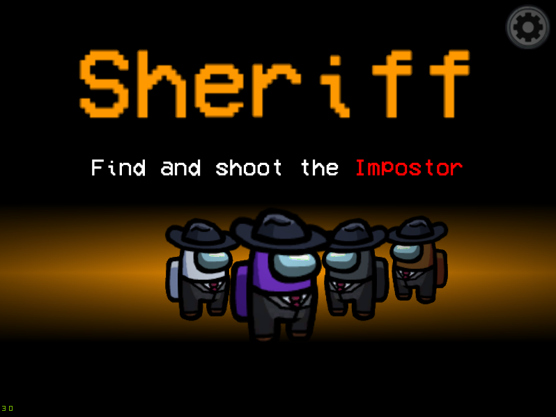
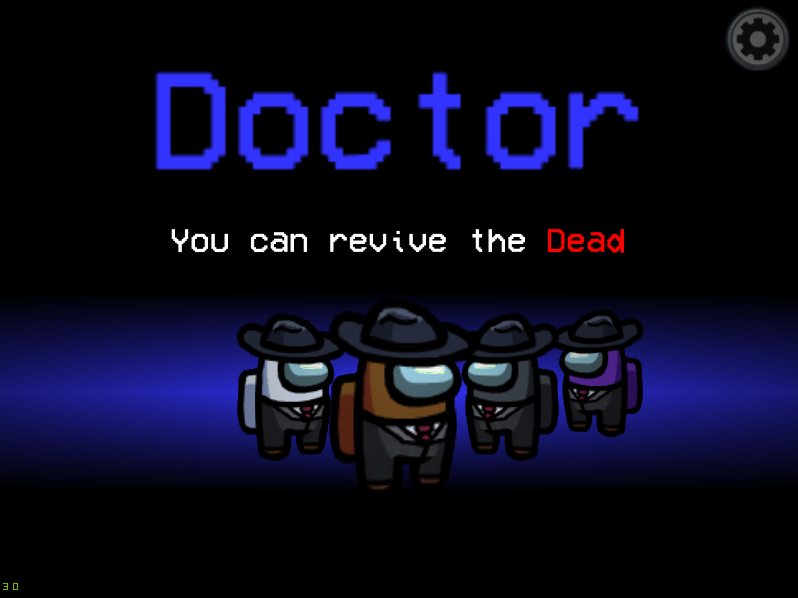
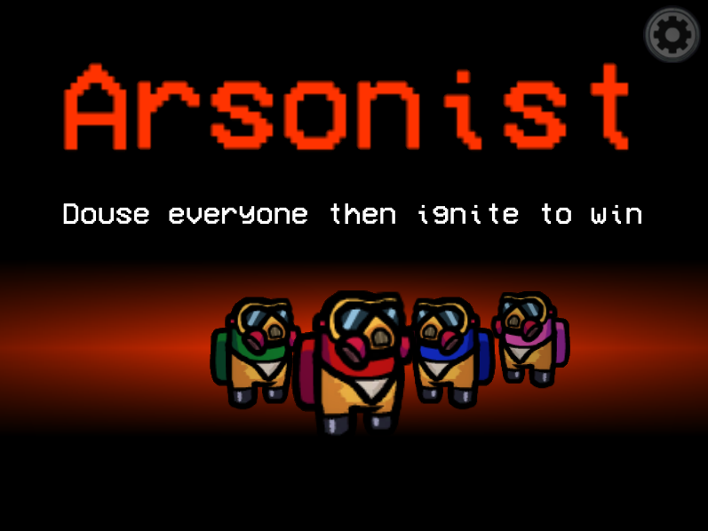
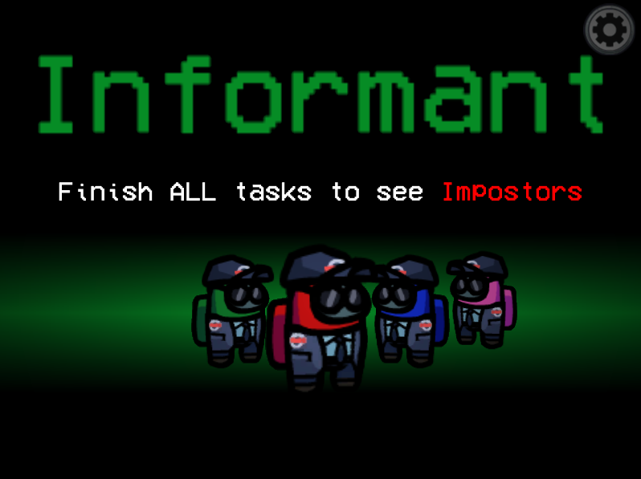

# Town Of Impostors
Town Of Impostors Mod is an Among Us modification for **PC/Windows**. This mod aims to add new roles, abilities & options to enhance the gameplay. It can also **be used in public servers**.

More roles and abilities will be added in future versions.

</img>

</img>
</img>
</img>
</img>
</img>
</img>
</img>
</img>

---

# Roles, Abilities & Custom Options

### General Custom Options
- **Custom Role Eject Confirmation:** Enables ejects to show the special role of the player being ejected, assuming "Confirm Ejects" option is on
- **Same Roles Know Each Other:** Allows players of the same role to see each other (via highlighted names)
- **Comms Sabotage Causes Anonymity:** Improves the Comms Sabotage to turn everyone anonymous
- **Ghosts Use Crewmate Vision:** Ghosts will no longer have ghost vision (where they can see everything), they will now instead use normal crewmate vision. _This option is recommended if there is a Doctor in the game_
- **Impostors Can Kill Each Other:** Allows Impostors to target and kill each other

## Crewmate Team

The special roles in the Crewmate Team. The goal of the Crewmate Team is to combine their abilities and knowledge to **find the Impostors**. The Crewmate Team will win if all Impostors are ejected or killed.

### Sheriff
The Sheriff is a role that has the ability to kill Impostors. However, if they attempt to kill a fellow crewmate, they will lose their own life instead as a punishment.

Custom Options

  
+ **% Sheriff Chance:** Chance of a Sheriff being added to the role selection pool
+ **# Max Sheriff Count:** The maximum number of Sheriffs that can be added to the role selection pool
+ **Sheriff Kill Cooldown:** Kill cooldown for the Sheriff
+ **Show Sheriff:** Shows the Sheriff to other players (via a highlighted name)
+ **Innocent Target Also Dies:** The Innocent target will also be killed along with the Sheriff
+ **Jester Is Enemy:** Jester will no longer count as "Innocent"
+ **Arsonist Is Enemy:** Arsonist will no longer count as "Innocent"

### Doctor
The Doctor is a role that has the ability to revive dead players. However, this means they are also able to revive Impostors that have been killed by the Sheriff.

Custom Options

  
+ **% Doctor Chance:** Chance of a Doctor being added to the role selection pool
+ **# Max Doctor Count:** The maximum number of Doctors that can be added to the role selection pool
+ **Doctor Revive Cooldown:** Cooldown for the Doctor Revive Ability
+ **Doctor Revive Time:** The time is takes for a Doctor to successfully revive a player
+ **Start Cooldown On Failed Revives:** Start Revive Ability Cooldown if revive fails (if body is removed or disposed)
+ **Medbay Revive Only:** Only allow revives in the Medbay location of a map
+ **Arsonist Is Enemy:** Crewmates with special roles lose their role if revived (Does not affect Jester & Arsonist)

### Agent
The Agent is a powerful role that has abilities allowing them to access map intel from anywhere. This includes the admin table map, security cameras, door logs and vitals if any are accessible. This gives them much more information on what is going on around the map, but they shouldn't neglect their tasks either.

Custom Options

  
+ **% Agent Chance:** Chance of a Agent being added to the role selection pool
+ **# Max Agent Count:** The maximum number of Agents that can be added to the role selection pool
+ **Agent Tech Cooldown:** The cooldown of Agent's abilities (the cooldowns are separate between the abilities, but they will all have the same cooldown time)
+ **Can Use Admin Map:** Agent can activate Admin Map
+ **Can Use Cameras:** Agent can activate Cameras _(Skeld and Polus Only)_
+ **Can Use Door Logs:** Agent can activate Door Logs _(MIRA HQ Only)_
+ **Can Use Vitals:** Agent can activate Vitals _(Polus Only)_

### Detective
The Detective is a role that can see footprints and get extra information when reporting bodies (They will get a body report in chat only they can see, which shows time of death and if the body was moved or not). They should use this ability to track down Impostors, but they should also be careful not to frame the wrong person.

Custom Options

  
+ **% Detective Chance:** Chance of a Detective being added to the role selection pool
+ **# Max Detective Count:** The maximum number of Detectives that can be added to the role selection pool
+ **Footprint Duration:** How long the footprints will last in seconds
+ **Anonymous Footprints:** Whether the footprints should be anonymous or not
+ **Extra Information On Report:** If Detective reports a body, they will get an additional "Body Report" via messages (which only they can see). Shows how long the player has been dead for, as well as whether the body has been moved or not
+ **Killers Leave Bloody Prints:** Killers _(includes both Sheriffs & Impostors)_ will leave bloody footprints after a kill
+ **Bloody Prints Duration:** Duration for how long Killers should have bloody footprints for

### Plumber
The Plumber is a role that can use vents to travel around. They can also stay in vents to observe the room. But they should be careful not to be suspected as the Impostor or noticed by the Impostor.

Custom Options

  
+ **% Plumber Chance:** Chance of a Plumber being added to the role selection pool
+ **# Max Plumber Count:** The maximum number of Plumbers that can be added to the role selection pool

### Informant
The Informant is a role that can see other roles after they are finished with ALL their tasks. They will be "Informed" after finishing tasks, but should also be careful of Impostors that are notified about them. The Informant can only be informed or revealed after **completing at least one task**.

Custom Options

  
+ **% Informant Chance:** Chance of a Informant being added to the role selection pool
+ **# Max Informant Count:** The maximum number of Informants that can be added to the role selection pool
+ **Impostors Are Notified:** Toggles whether Impostors will be notified and also have the Informant revealed to them
+ **Tasks Left When Impostors Notified:** How many tasks left for the Informant before Impostors are notified about them
+ **Show Arrows (Informants And Impostors):** Show arrows pointing to Informants/Impostors if either have been revealed. These can only be seen by Informants or Impostors depending on options that are enabled
+ **See Jester After Tasks:** Toggles whether Informants can see Jesters after tasks
+ **See Arsonists After Tasks:** Toggles whether Informants can see Arsonists after tasks
+ **See Crewmate Roles After Tasks:** Toggles whether Informants can see Crewmate special roles _(if any)_ after tasks
+ **Highlight Names In Meetings:** Toggles whether names are highlighted in meetings too _(for Informants & Impostors)_

## Other Teams

### Jester
The Jester is a role with no abilities and no tasks to do (they get fake tasks like Impostors). They are in their own team, and their goal is to get themselves ejected from the ship and make sure not to get killed by the Impostors. They will win instantly if ejected from the ship. However, if they are killed, they will have no way to win and essentially lose.

Custom Options

  
+ **% Jester Chance:** Chance of a Jester being added to the role selection pool
+ **Enable Jester:** Allow Jester to be added to the role selection pool 
+ **Jester Can Fix Sabotages:** Allow Jester to fix sabotages
+ **Jester Wins From Sheriff Kill:** Jester will win if killed by the Sheriff

### Arsonist
The Arsonist is a role that aims to douse everyone alive and igniting them all to win alone. They need to do this before the Crewmate Team wins by finding all the Impostors. They have no tasks (they get fake tasks like Impostors), but should be careful not to be suspected as they have to say close for the duration of time they are dousing. They should also be careful not to be killed by the Impostor.

Custom Options

  
+ **% Arsonist Chance:** Chance of a Arsonist being added to the role selection pool
+ **Enable Arsonist:** Allow Arsonist to be added to the role selection pool 
+ **Douse Time:** How long it takes for Arsonist to douse a target
+ **Arsonist Can Fix Sabotages:** Toggles whether Arsonists can fix sabotages
+ **Arsonist Must Refuel:** Toggles whether Arsonists must refuel after set amount of douses
+ **# Douses Stored:** Number of successful Douses before Arsonists must refuel _(if refuel option is toggled on)_

### Impostor
The Impostor has additional abilities they can make use of:
- **Drag & Drop Bodies:** Impostors can drag around and drop dead bodies to reposition them. They may also drag bodies through vents.
- **Dispose Bodies:** Impostors can dispose a body they are dragging if they are close to a vent or inside the vents. But when bodies are disposed, a bloodstain is left behind on the vent to give crewmates a clue.
- **Disguise:** Impostors can disguise as another player for set duration. They must first sample the DNA of a player by being nearby the player.

Custom Options

  
+ **Drag And Drop Ability:** Toggle the Drag and Drop Ability
+ **Disguise Ability:** Toggle the Disguise Ability
+ **Disguise Cooldown:** Cooldown for the Disguise Ability
+ **Disguise Duration:** How long the Disguise lasts for in seconds
+ **Dispose Body Ability:** Toggle the Dispose Body Ability
+ **Dispose Body Cooldown:** Cooldown for the Dipose Body Ability
+ **Enable Impostor Messaging:** Toggle on/off Impostor Comms. Impostor Comms allows Impostors to chat to each other in-game via the chat messaging system, outside of meetings
+ **Can Vent With Body:** Toggle whether the Impostor can vent with bodies

# How does role assignment work?
The role selection works as follows:
For each role, it will take the count and attempt to add that to the selection pool **X** number of times, where **X** is the maximum count. The chance of the role being added to the selection pool each time is based on the percentage chance set in the custom options for the specified role.

Once the selection pool is filled, the roles in there will then be randomly assigned to Crewmates (who are not already Impostors). As long as there are roles in the pool to assign, the role selection will assign them out. If there are no more roles to be assigned out, the remaining players will just stay as normal Crewmates.

Example:
_**Sheriffs - # Max Count: 3 - % Chance: 50**_
This means that the role selection will try to put 3 sheriffs into the pool, at 50% chance each time. So the pool can end up with 0, 1, 2 or even the maximum of 3 Sheriffs.

---

<h1 id="installation">Installation</h1>

- Download the Mod for your specific game version. You are not able to launch the game if the versions do not match.
- Make a copy of your game’s root directory ("Steam/steamapps/common/Among Us"). You can get to your root directory by right-clicking Among Us in steam -> Properties -> Local Files -> Browse. and rename it to whatever you want (e.g. "Steam/steamapps/common/Among Us Town Of Impostors")
- Extract the contents TownOfImpostors.zip into the copied folder you created
- **Make sure to launch the game via Among Us.exe**
- Please note that the first time launching the game with this mod may take a while

**If you do not follow the installation instructions exactly, or you use a Mod Manager or other mods with this mod, I cannot guarantee the mod will work as intended. Please only raise issues if you've followed installations exactly and you are not using any mod manager or other mods.**

**When updating from version to version, settings can bug and cause unintended effects. This is due to how new custom settings are being added in each update. If you are getting strange bugs occurring with the settings, try manually settings everything again (to overwrite the saved settings on your computer) by manually toggling options on and off, setting timers and settings counts. You can also do a hard reset by running vanilla among us and creating a lobby, then reopening among us with this mod.**

**Starting from v1.5.0 onwards, there is a new reset custom settings button in the lobby. Please use it if your settings are bugged. Settings can bug when you update from version to version, it's best practice to reset settings.**

**Starting from v1.6.0 onwards, this mod should now be compatible with Mod Manager by MatuxGG. Please note that using the Mod Manager to install the mod still does not guarantee that the mod will work as intended.**

**Verifying installation success**
- Launch the game via Among Us.exe
- In the top-left corner, below Among Us version, you should see _Town Of Impostors vX.X.X Mod by AJMix_

If you don't see this message please take a look at the 
  <a href="#troubleshooting">troubleshooting section</a>.

 
<h2>Releases and Compatibility</h2>
<table style="width:100%">
  <tr>
    <th>Among Us Version</th>
    <th>Mod Version</th>
    <th>Link</th>
  </tr>
  <tr>
    <td>v2021.3.5s</td>
    <td>v1.6.0</td>
    <td><a href="https://github.com/AJMix/TownOfImpostors/releases/download/v1.6.0/TownOfImpostors1.6.0.zip">Download</></td>
   </tr>
   <tr>
    <td>v2021.3.5s</td>
    <td>v1.5.0</td>
    <td><a href="https://github.com/AJMix/TownOfImpostors/releases/download/v1.5.0/TownOfImpostors1.5.0.zip">Download</></td>
   </tr>
    <tr>
    <td>v2021.3.5s</td>
    <td>v1.4.0</td>
    <td><a href="https://github.com/AJMix/TownOfImpostors/releases/download/v1.4.0/TownOfImpostors1.4.0.zip">Download</></td>
  </tr>
    <tr>
    <td>v2021.3.5s</td>
    <td>v1.3.0</td>
    <td><a href="https://github.com/AJMix/TownOfImpostors/releases/download/v1.3.0/TownOfImpostors1.3.0.zip">Download</></td>
  </tr>
    <tr>
    <td>v2020.12.9s</td>
    <td>v1.2.0</td>
    <td><a href="https://github.com/AJMix/TownOfImpostors/releases/download/v1.2.0/TownOfImpostors1.2.0.zip">Download</></td>
  </tr>
   <tr>
    <td>v2020.12.9s</td>
    <td>v1.1.0</td>
    <td><a href="https://github.com/AJMix/TownOfImpostors/releases/download/v1.1.0/TownOfImpostors1.1.0.zip">Download</></td>
  </tr>
  <tr>
    <td>v2020.12.9s</td>
    <td>v1.0.0</td>
    <td><a href="https://github.com/AJMix/TownOfImpostors/releases/download/v1.0.0/TownOfImpostors1.0.0.zip">Download</></td>
  </tr>
</table>

  
Changelog

  

  
v1.6.0

  <h3>v1.6.0</h3>
   <ul>
    <li>Informant role</li>
    <li>Doctor Medbay only fix for Polus</li>
    <li>DNA Sample button improved</li>
    <li>Mod Manager (by MatuxGG)/Reactor.Essentials compatibility</li>
    <li>Fixed disguising-pet-vent bug</li>
    <li>Custom Option: Crewmate Ghosts Use Crewmate Vision</li>
    <li>Percentage Chance for Roles</li>
    <li>New 1,2,3,4.. Keybinds for Abilities</li>
     <li>Arsonist better end visuals</li>
     <li>Custom Option for killers to leave bloody footprints for detective</li>
     <li>Custom Option to allow Impostors to kill each other</li>
     <li>Custom Option for Arsonist to refuel</li>
     <li>Custom Option for Jester to win from Sheriff Kill</li>
     <li>Custom Option for Doctor Revive to remove Crewmate special role</li>
     <li>Custom Option to change whether Impostor can vent with body or not</li>
     <li>Custom Option for Doctor Revive Time</li>
     <li>Fixed bug with Detective seeing Impostor colour footprints despite being disguised</li>
     <li>Fixed bug with Pets reappearing during comms sabotage after meeting</li>
     <li>Fixed bug with buttons being used in meetings</li>
     <li>Balance Fix: Custom Buttons cooldowns no longer continue going down during meetings</li>
     <li>Removed CUSTOM server option (please look into Unify by MoltenMods)</li>
     <li>Various null fixes</li>
     <li>Optimisations</li>
   </ul>
    

  

  
v1.5.0

  <h3>v1.5.0</h3>
   <ul>
    <li>Impostor Drag & Drop Body Ability toggle</li>
    <li>Arsonist Role</li>
    <li>Plumber Role</li>
    <li>Detective Role</li>
    <li>Doctor Drag & Drop Body Ability</li>
    <li>Doctor Option: Medbay revives only</li>
    <li>Impostor Comms</li>
    <li>Comms sabotage causes anonymity</li>
     <li>Jester Victory Screen Fix</li>
     <li>Dead bodies won't play kill animation on vent exit</li>
     <li>You can now sample DNA from dead bodies</li>
     <li>Fake tasks for Jester & Arsonist</li>
     <li>Role description in task list</li>
     <li>Reset custom settings button in lobby</li>
     <li>Updated role selection process</li>
     <li>Dispose Bodies leave bloodsplat</li>
     <li>Button bug fixes</li>
     <li>Anonymous Votes resetting fix</li>
     <li>Various null fixes</li>
     <li>Optimisations</li>
   </ul>
    

  

  
v1.4.0

  <h3>v1.4.0</h3>
   <ul>
    <li>Agent Role</li>
    <li>Fixed settings resetting bug</li>
    <li>Added CUSTOM server option</li>
    <li>Sheriff custom kill button sprite</li>
    <li>Option for same roles to know each other</li>
    <li>Option for Sheriff to kill non-impostors</li>
    <li>Sheriff Kill CD changes</li>
    <li>Various null fixes</li>
   </ul>
  

  

  
v1.3.0

    <h3>v1.3.0</h3>
   <ul>
    <li>Compatibility with v2021.3.5s</li>
    <li>Updated custom options to be more clean & clear</li>
    <li>New ability to cycle through options HUD display</li>
    <li>Jester role</li>
    <li>Fixed issue with Sheriff being able to kill through walls</li>
    <li>Fixed detection through walls for other abilities</li>
    <li>Fixed issue with dragging body sometimes not rendering on top of ground</li>
    <li>Various null fixes</li>
   </ul>
  

  

  
v1.2.0

  <h3>v1.2.0</h3>
   <ul>
    <li>Fixed Sheriff being able to kill Impostor in vent</li>
    <li>Disguise should now work properly with pets</li>
    <li>Several other null bugs</li>
   </ul>
  

  

  
v1.1.0

  <h3>v1.1.0</h3>
   <ul>
    <li>Fixed taskbar not updating and removing "you are dead" line when revived</li>
    <li>Fixed bug with Sheriff not being able to kill Impostor</li>
    <li>Several nullpointer bugfixes</li>
   </ul>
  

<h2>Curseforge</h2>
You can download the mod on Curseforge <a href="https://www.curseforge.com/among-us/all-mods/town-of-impostors">here</a>

---

# Q&A
 
### Can you play Proximity Chat (Crewlink) with it?
Yes, Crewlink supports Among Us Modifications

### Can you get banned for playing on public Servers?
At the current state of the game there is no perma ban system for the game. The mod is designed in a way, that it does not send prohibited server requests.
You are also able to join your own custom server to be safe <a href="https://github.com/Impostor/Impostor">(Impostor)</a>

### How can I join a custom server?
This functionality has been removed from 1.6.0 onwards. Please look into using <a href="https://github.com/MoltenMods/Unify">Unify</a>

### Do my friends need to install the mod to play it together?
Yes. Every player in the lobby must have the mod installed. Please don't use and play mods in unorganised public lobbies.

### Can this mod work with other mods?
I cannot guarantee that this mod will work with other mods. There will likely be conflicts. You will have to test yourself. 

---

# Contact & Donations

### Contact:
- **Discord:** AJMix#1111
- **Email:** <a href="mailto:ajmixdev@gmail.com">ajmixdev@gmail.com</a>

### Updates:
- **Twitter:** <a href="https://twitter.com/itsAJMix">itsAJMix</a>
- **Youtube:** <a href="https://www.youtube.com/user/AJMixChannel">AJMix</a>

### Donations:
<a href="https://www.paypal.com/donate?hosted_button_id=M2FL98EWXTQDE"></img></a>

All donations are appreciated and will go towards the development of mods.

---

<h1 id="troubleshooting">Troubleshooting</h1>

### The mod isn't installed or game doesn't launch
- Please make sure you're using the latest version of the mod and the correct version of Among Us for it
- Make sure you have followed all the <a href="#installation">installation steps</a>, especially launching the game via the Among Us.exe file
- You might be missing some cpp libs (software libraries used by the mod); please install <a href="https://aka.ms/vs/16/release/vc_redist.x86.exe">visual studio c++</a>

### I can't find my issue
You can <a href="https://github.com/AJMix/TownOfImpostors/issues/new">raise an issue within GitHub</a> documenting your issue. You will need to be logged into GitHub to do this.

## Known Issues
- When updating from version to version, settings can bug and cause unintended effects. This is due to how new custom settings are being added in each update. If you are getting strange bugs occurring with the settings, try manually settings everything again (to overwrite the saved settings on your computer) by manually toggling options on and off, setting timers and settings counts. You can also do a hard reset by running vanilla among us and creating a lobby, then reopening among us with this mod. In v1.5.0 onwards, there is a new reset settings button the host can make use of to do a hard reset on all custom settings to reset everything to default values

- Disconnections in the middle of the game can cause bugs to occur, and the only way to fix them would be starting a new game or restarting the game. This mod was made with the assumption that no one would disconnect as disconnections are a whole other edgecase to fix. Future updates will hopefully fix this, but for now, just start another game or restart the client if a disconnection causes your game to bug

- The Arsonist has to Douse targets again if the target is killed and then revived. This is unintended and will be fixed in a future release.

- With the new keybindings from 1.6.0 for special abilities, some roles are able to use their abilities while doing other things (such as tasks or fixing sabotages). This causes some small bugs for some special roles such as the **Agent**, where using the keybindings for abilities whilst having another window open will cause abilities to go into cooldown. But, this also makes some special roles with abilities a little bit more powerful. As of now, this is not known to cause any game breaking bugs, but will be fixed in a future release as it is unintended.

---

<h1>License</h1>

This software is distributed under the <b>GNU GPLv3</b> License.
<a href="https://github.com/BepInEx/BepInEx">BepinEx</a> is distributed under <b>LGPL-2.1</b> License.

