# Town Of Impostors
<p align="center">Town Of Impostors Mod is a modification for Among Us - <b>PC/Windows (Steam)</b>. This mod aims to add new roles & abilities to enhance gameplay, while also providing a full range of options to allow for customising and playing games your way.</p>

<p align="center"><b>Every player in the room must have the mod installed for it to work correctly. Please DO NOT play this mod on public lobbies, it is intended for private organised lobbies.</b></p>

<p align="center">
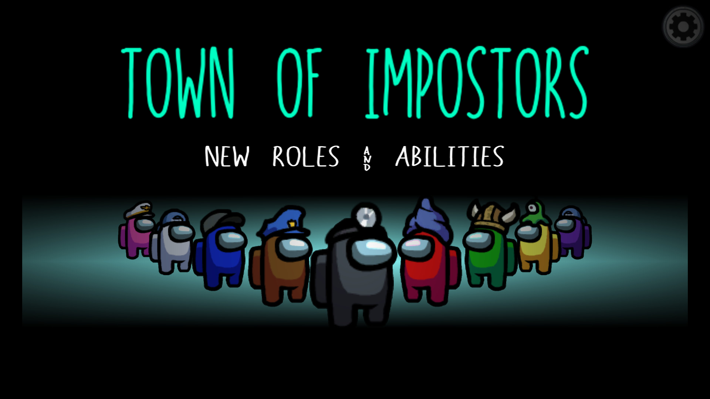
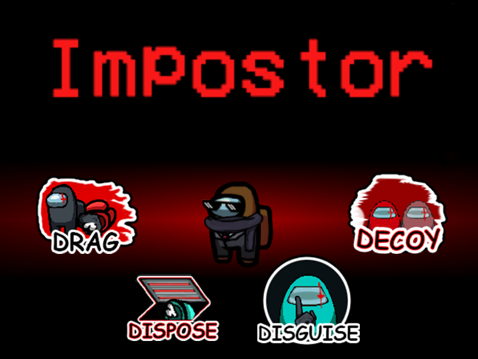
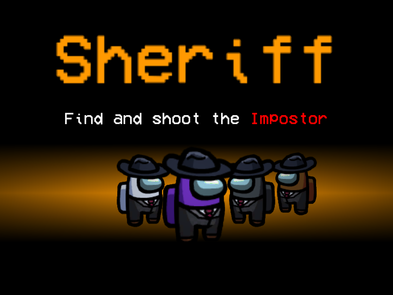
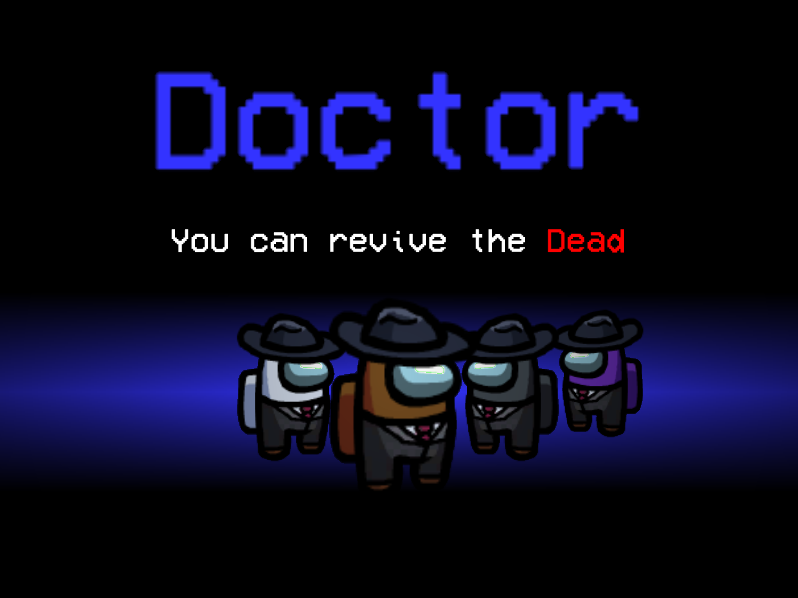
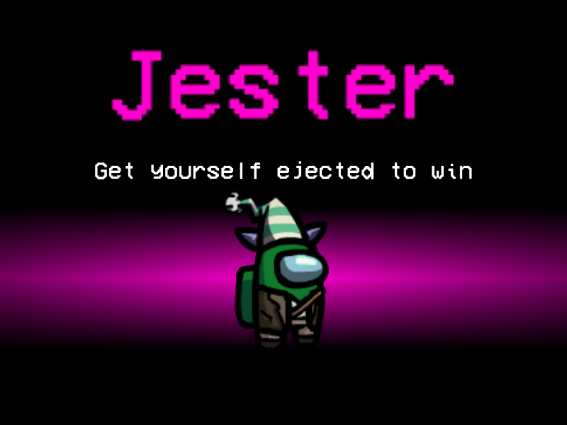
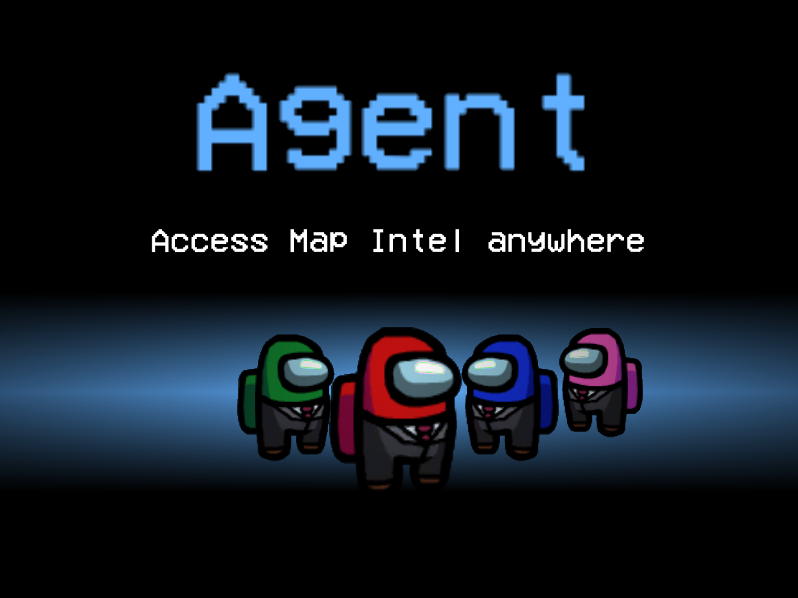
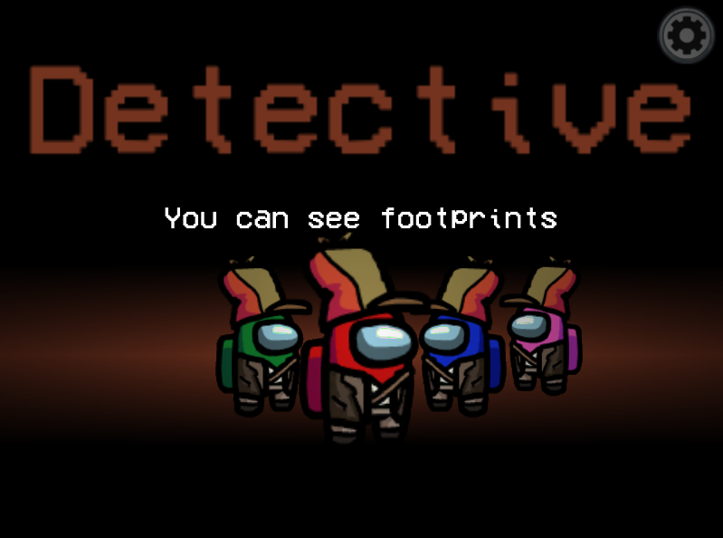
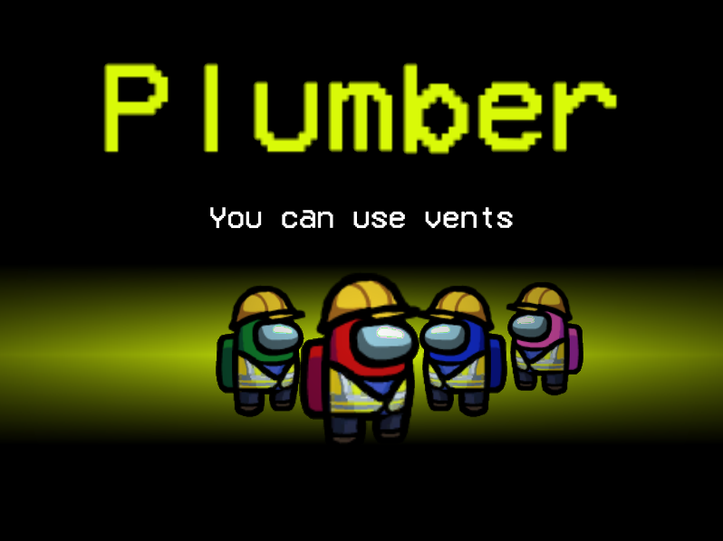
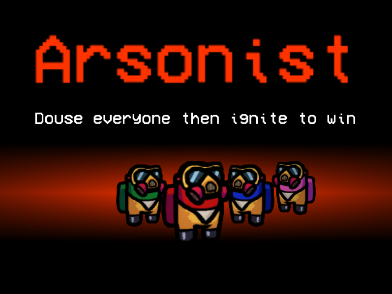
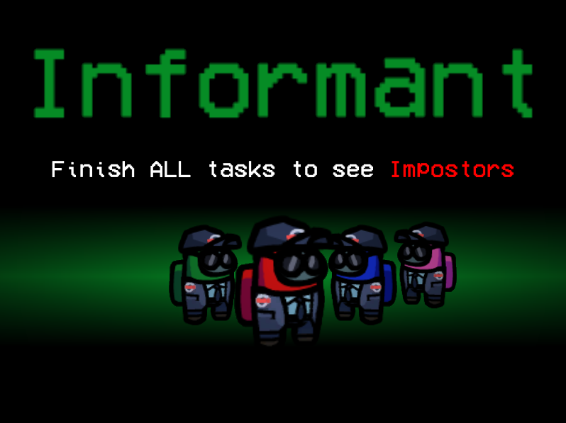
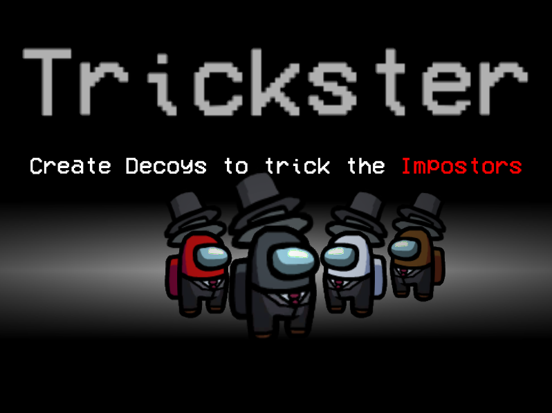
</p>

---

<p align="center">
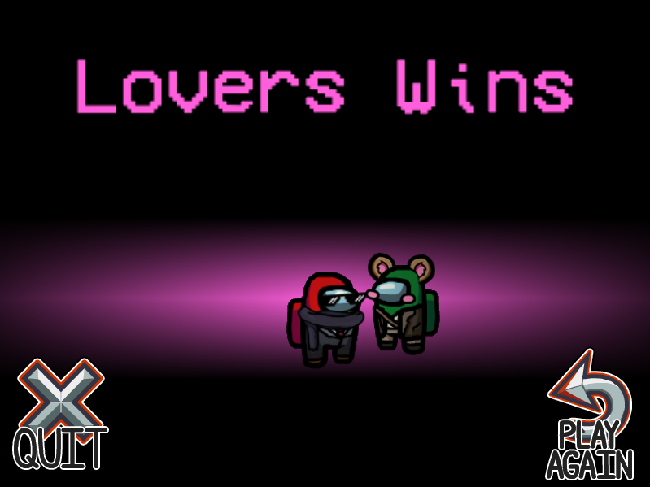
</p>

---

Table of Contents
=================
  * [Custom Hats](#customhats)
  * [Streamer Mode](#streamermode)
  * [Installation](#installation)
    * [Releases and Compatibility](#releases-and-compatibility)
    * [Uninstalling](#uninstalling-the-mod)
  * [Roles, Abilities, Modifiers & Custom Options](#roles-abilities--custom-options)
    * [Crewmate Team](#crewmate-team)
      * [Sheriff](#sheriff)
      * [Doctor](#doctor)
      * [Agent](#agent)
      * [Detective](#detective)
      * [Plumber](#plumber)
      * [Informant](#informant)
      * [Trickster](#trickster)
    * [Other Teams](#other-teams)
      * [Jester](#jester)
      * [Arsonist](#arsonist)
      * [Impostor](#impostor)
    * [Modifiers](#modifiers)
      * [Lovers](#lovers)
    * [How Role Assignment Works](#how-does-role-assignment-work)
  * [FAQ](#faq)
  * [Troubleshooting](#troubleshooting)
    * [Known Issues](#known-issues)
  * [Contact & Donations](#contact--donations)
  * [License](#license)

---

<h1 id="customhats">Custom Hats</h1>

### **Only for versions 1.7.1 onwards**

## How do I add my own Custom Hat?
* Download the template used to make the Custom Hat for Town Of Impostors:
  * Download .psd template [here](https://github.com/AJMix/TownOfImpostors/releases/download/v1.7.0/ToI_CustomHat_Template_150x185.psd)
  * Download .png template [here](https://github.com/AJMix/TownOfImpostors/releases/download/v1.7.0/ToI_CustomHat_Template_150x185.png)
* Draw your hat on the template and save in PNG format, with a unique name (make sure to also hide the crewmate and shadow). Preserve the resolution.
  
* **IMPORTANT:** Please follow this naming convention `<HatName>_<Credits>_<Modifiers>`. If you want spaces in your names, use `-` to represent spaces. For example, `Bouncy-Hat` will be processed into `Bouncy Hat` inside the game.
  * **For Modifiers:** if you want your hat to be behind the crewmate (i.e. wings), add a `_back` to the name. If you want it to bounce while the crewmate walks, add a `_bounce` to the name. These are **case sensitive**. 
  * **Example Names:** `Wing_Spaced-AJMix_back.png`, `Bouncy-Hat_AJMix_bounce.png`, `BouncyWings_AJMix_back_bounce.png`, `Simple-Hat_AJMix.png`

* Place the custom hat png into the `TownOfImpostors_CustomHats` which can be found inside of the Among Us directory you have the mod installed (launch the game once and start a lobby with the mod or create the folder yourself if it does not exist)

* Your custom hat should now appear in the hats tab **locally**. If you want everyone to see the same thing **make sure everyone has the same hats in the custom hats folder.**

## Want to add your hat as part of the mod so everyone can use it?
* Simply follow the same steps above to create a Custom Hat, then send me your Custom Hat .png via any means. Please also follow the naming convention so I know the hat name, credits and whether you'd like it to be added to the **back** of the crewmate and whether you'd like it to **bounce**.
* The Hat Name and Credits will be grabbed from the file name, as long as you have followed the naming convention. When someone wears your hat, credits will appear underneath the mod credits! (i.e. `AJ Scarf by AJMix`, `Dark Scarf by Darkbrussel`)
* I'll try my best to get your Custom Hat into the next release of Town Of Impostors!

## How about the hat angles for animations such as the ladder climb in Airship?
That currently won't be supported yet for custom hats. But, I plan to add support for those in a future version!

---

<h1 id="streamermode">Streamer Mode</h1>

From 1.7.1 onwards, there is a new streamer mode that can be toggled on.

This makes it easier for streamers as they won't have to manually hide the code anymore on stream, it will be hidden automatically.

### How do I get the room code?
When you create a room, the room code will be copied to your clipboard. Simply paste it somewhere and pass it onto others.

If you accidentally copied something else before pasting the room code somewhere, you can get your copy/clipboard history by using `Windows Key + V`. Or you can just make another room.

---

<h1 id="installation">Installation</h1>

- Before installing, verify your Among Us version by launching the game and checking the version displayed in the top left of the main menu.

- Download the Mod for your specific game version from the table below or check all releases [here](https://github.com/AJMix/TownOfImpostors/releases). **ENSURE THAT YOUR AMONG US VERSION MATCHES EXACTLY - EVERY DIGIT, LETTER, DOT & ALL.**

- Make a copy of your game’s root directory ("Steam/steamapps/common/Among Us"). You can get to your root directory by right-clicking Among Us in Steam -> Properties -> Local Files -> Browse. and rename it to whatever you want (e.g. "Steam/steamapps/common/Among Us Town Of Impostors").

- Extract the contents TownOfImpostors.zip into the copied folder you created.

- Ensure the copied directory that is being modded now contains at least the following:
```
.
├── Among Us_Data
├── BepInEx <--
├── mono <--
├── Among Us.exe
├── baselib.dll
├── changelog.txt
├── doorstop_config.ini <--
├── GameAssembly.dll
├── steam_appid.txt <--
├── UnityCrashHandler32.exe
├── UnityPlayer.dll
└── winhttp.dll <--
```
<details>
 <summary>Still unsure? Here's an image of what it should look like if you have hidden file name extensions</summary>
 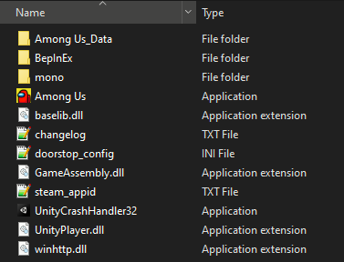
 </details>
 
- **Make sure to launch the game via the Among Us.exe from this directory**. Please note that the first time launching the game with this mod may take a while.

**Verifying installation success**
- Launch the game via Among Us.exe
- In the top-left corner of the main menu, below the Among Us version, you should see _Town Of Impostors vX.X.X Mod by AJMix_ to indicate the mod is running and has been successfully installed.

If you don't see this message or have any other issues, please take a look at the <a href="#troubleshooting">troubleshooting section</a>.

**Before raising an issue, please double check that you have accurately followed the installation instructions and you are not using any mod manager or other mods.**

**Starting from v1.5.0 onwards, there is a new reset custom settings button in the lobby. Please use it if your settings are bugged. Settings can bug when you update from version to version, it's best practice to reset settings.**

**Starting from v1.6.0 onwards, this mod should now be compatible with Mod Manager by MatuxGG. Please note that using the Mod Manager to install the mod still does not guarantee that the mod will work as intended.**

#### Uninstalling the Mod
- If you copied the Among Us folder as instructed by the Installation Steps, simply delete the copied folder.
- If you did not, and you unzipped the mod into your main Among Us folder, then you have to delete the following folders & files:
  - **BepInEx** folder, **mono** folder, **doorstop_config.ini**, **winhttp.dll**
 
<h2>Releases and Compatibility</h2>

If the table is not yet updated, check all releases [here](https://github.com/AJMix/TownOfImpostors/releases).

<table style="width:100%">
  <tr>
    <th>Among Us Version</th>
    <th>Mod Version</th>
    <th>Link</th>
  </tr>
 <tr>
    <td>v2021.3.31.3s</td>
    <td>v1.7.1</td>
    <td><a href="https://github.com/AJMix/TownOfImpostors/releases/download/v1.7.1/TownOfImpostors1.7.1.zip">Download</></td>
   </tr>
  <tr>
  <tr>
    <td>v2021.3.31.3s</td>
    <td>v1.7.0</td>
    <td><a href="https://github.com/AJMix/TownOfImpostors/releases/download/v1.7.0/TownOfImpostors1.7.0.zip">Download</></td>
   </tr>
  <tr>
  <tr>
    <td>v2021.3.5s</td>
    <td>v1.6.1</td>
    <td><a href="https://github.com/AJMix/TownOfImpostors/releases/download/v1.6.1/TownOfImpostors1.6.1.zip">Download</></td>
   </tr>
  <tr>
    <td>v2021.3.5s</td>
    <td>v1.6.0</td>
    <td><a href="https://github.com/AJMix/TownOfImpostors/releases/download/v1.6.0/TownOfImpostors1.6.0.zip">Download</></td>
   </tr>
   <tr>
    <td>v2021.3.5s</td>
    <td>v1.5.0</td>
    <td><a href="https://github.com/AJMix/TownOfImpostors/releases/download/v1.5.0/TownOfImpostors1.5.0.zip">Download</></td>
   </tr>
    <tr>
    <td>v2021.3.5s</td>
    <td>v1.4.0</td>
    <td><a href="https://github.com/AJMix/TownOfImpostors/releases/download/v1.4.0/TownOfImpostors1.4.0.zip">Download</></td>
  </tr>
    <tr>
    <td>v2021.3.5s</td>
    <td>v1.3.0</td>
    <td><a href="https://github.com/AJMix/TownOfImpostors/releases/download/v1.3.0/TownOfImpostors1.3.0.zip">Download</></td>
  </tr>
    <tr>
    <td>v2020.12.9s</td>
    <td>v1.2.0</td>
    <td><a href="https://github.com/AJMix/TownOfImpostors/releases/download/v1.2.0/TownOfImpostors1.2.0.zip">Download</></td>
  </tr>
   <tr>
    <td>v2020.12.9s</td>
    <td>v1.1.0</td>
    <td><a href="https://github.com/AJMix/TownOfImpostors/releases/download/v1.1.0/TownOfImpostors1.1.0.zip">Download</></td>
  </tr>
  <tr>
    <td>v2020.12.9s</td>
    <td>v1.0.0</td>
    <td><a href="https://github.com/AJMix/TownOfImpostors/releases/download/v1.0.0/TownOfImpostors1.0.0.zip">Download</></td>
  </tr>
</table>

<details>
  <summary>Changelog</summary>
 <details>
  <summary>v1.7.1</summary>
  <h3>v1.7.1</h3>
   <ul>
    <li>Compatibility with 2021.3.31.3s</li>
    <li>CUSTOM HATS! (See instructions on how this works at the top)</li>
    <li>Streamer Mode (See instructions on how this works at the top)</li>
    <li>Fixed role selection not properly randomising player list (host always got a role no matter what)</li>
     <li>Bloodstains on vents should now properly disappear after meetings</li>
     <li>Detective footprints now properly disappear after they lose their role from revives)</li>
     <li>Fixed ghost crewmate vision that broke in the latest version</li>
     <li>Made Informant arrows bigger</li>
     <li>Fixed issue with disguise revealing impostors before meetings</li>
     <li>Fixed role description text not appearing properly</li>
     <li>Fixed a bug that caused infinite duration for some abilities</li>
     <li>Fixed agent abilities being broken in some maps</li>
     <li>[Modifier] Lover Modifier</li>
    <li>[Custom Option] Disguised Footprints: Toggles whether Disguised Impostors leave Disguised Footprints</li>
    <li>[Custom Option] Agent Abilities Share Cooldown: Toggles whether all Agent abilities should go into cooldown when using one ability</li>
    <li>[Custom Option] Game Continues With Arsonist: Toggles whether the game continues if Arsonist is still alive</li>
    <li>[Custom Option] Disable Body Report: Toggles whether body reports are enabled or not</li>
   </ul>
    </details>
  <details>
  <summary>v1.7.0</summary>
  <h3>v1.7.0</h3>
   <ul>
    <li>Compatibility with 2021.3.31.3s</li>
    <li>Compatibilities with Airship</li>
    <li>Trickster Role</li>
    <li>Impostor Decoy Abilities (Like Trickster)</li>
     <li>Lobby Role Summary for Chances and Count</li>
     <li>Lobby Improvements (Role Bookmarks)</li>
     <li>Colorblind Friendly Updates</li>
     <li>Fixed bugs with Impostor Comms</li>
     <li>Dousing & Reviving now show progress bars instead</li>
     <li>Fixed bugs with dead bodies using wrong colours on Comms Sabotage</li>
     <li>Fixed some buttons resetting CDs on opening windows</li>
     <li>Fixed issue with toggle buttons blocking scrolling/clickable anywhere (don't know why Innersloth made it like this)</li>
     <li>Various bug fixes & optimisations</li>
   </ul>
    </details>
  <details>
  <summary>v1.6.1</summary>
  <h3>v1.6.1</h3>
   <ul>
    <li>Fixed issue with DLL plugin no longer working</li>
    <li>Disguise issues with Meetings and KillOverlay fixed</li>
    <li>Fixed revived players losing "Douse" state</li>
    <li>Fixed hotkeys still working while other windows are opened</li>
     <li>Fixed abilities being able to be used while doing other things</li>
   </ul>
    </details>
  <details>
  <summary>v1.6.0</summary>
  <h3>v1.6.0</h3>
   <ul>
    <li>Informant role</li>
    <li>Doctor Medbay only fix for Polus</li>
    <li>DNA Sample button improved</li>
    <li>Mod Manager (by MatuxGG)/Reactor.Essentials compatibility</li>
    <li>Fixed disguising-pet-vent bug</li>
    <li>Custom Option: Crewmate Ghosts Use Crewmate Vision</li>
    <li>Percentage Chance for Roles</li>
    <li>New 1,2,3,4.. Keybinds for Abilities</li>
     <li>Arsonist better end visuals</li>
     <li>Custom Option for killers to leave bloody footprints for detective</li>
     <li>Custom Option to allow Impostors to kill each other</li>
     <li>Custom Option for Arsonist to refuel</li>
     <li>Custom Option for Jester to win from Sheriff Kill</li>
     <li>Custom Option for Doctor Revive to remove Crewmate special role</li>
     <li>Custom Option to change whether Impostor can vent with body or not</li>
     <li>Custom Option for Doctor Revive Time</li>
     <li>Fixed bug with Detective seeing Impostor colour footprints despite being disguised</li>
     <li>Fixed bug with Pets reappearing during comms sabotage after meeting</li>
     <li>Fixed bug with buttons being used in meetings</li>
     <li>Balance Fix: Custom Buttons cooldowns no longer continue going down during meetings</li>
     <li>Removed CUSTOM server option (please look into Unify by MoltenMods)</li>
     <li>Various null fixes</li>
     <li>Optimisations</li>
   </ul>
    </details>
  <details>
  <summary>v1.5.0</summary>
  <h3>v1.5.0</h3>
   <ul>
    <li>Impostor Drag & Drop Body Ability toggle</li>
    <li>Arsonist Role</li>
    <li>Plumber Role</li>
    <li>Detective Role</li>
    <li>Doctor Drag & Drop Body Ability</li>
    <li>Doctor Option: Medbay revives only</li>
    <li>Impostor Comms</li>
    <li>Comms sabotage causes anonymity</li>
     <li>Jester Victory Screen Fix</li>
     <li>Dead bodies won't play kill animation on vent exit</li>
     <li>You can now sample DNA from dead bodies</li>
     <li>Fake tasks for Jester & Arsonist</li>
     <li>Role description in task list</li>
     <li>Reset custom settings button in lobby</li>
     <li>Updated role selection process</li>
     <li>Dispose Bodies leave bloodsplat</li>
     <li>Button bug fixes</li>
     <li>Anonymous Votes resetting fix</li>
     <li>Various null fixes</li>
     <li>Optimisations</li>
   </ul>
    </details>
  <details>
  <summary>v1.4.0</summary>
  <h3>v1.4.0</h3>
   <ul>
    <li>Agent Role</li>
    <li>Fixed settings resetting bug</li>
    <li>Added CUSTOM server option</li>
    <li>Sheriff custom kill button sprite</li>
    <li>Option for same roles to know each other</li>
    <li>Option for Sheriff to kill non-impostors</li>
    <li>Sheriff Kill CD changes</li>
    <li>Various null fixes</li>
   </ul>
  </details>
  <details>
  <summary>v1.3.0</summary>
    <h3>v1.3.0</h3>
   <ul>
    <li>Compatibility with v2021.3.5s</li>
    <li>Updated custom options to be more clean & clear</li>
    <li>New ability to cycle through options HUD display</li>
    <li>Jester role</li>
    <li>Fixed issue with Sheriff being able to kill through walls</li>
    <li>Fixed detection through walls for other abilities</li>
    <li>Fixed issue with dragging body sometimes not rendering on top of ground</li>
    <li>Various null fixes</li>
   </ul>
  </details>
  <details>
  <summary>v1.2.0</summary>
  <h3>v1.2.0</h3>
   <ul>
    <li>Fixed Sheriff being able to kill Impostor in vent</li>
    <li>Disguise should now work properly with pets</li>
    <li>Several other null bugs</li>
   </ul>
  </details>
  <details>
  <summary>v1.1.0</summary>
  <h3>v1.1.0</h3>
   <ul>
    <li>Fixed taskbar not updating and removing "you are dead" line when revived</li>
    <li>Fixed bug with Sheriff not being able to kill Impostor</li>
    <li>Several nullpointer bugfixes</li>
   </ul>
  </details>
</details>

<h2>Curseforge</h2>
You can download the mod on Curseforge <a href="https://www.curseforge.com/among-us/all-mods/town-of-impostors">here</a>.

---

# Roles, Abilities, Modifiers & Custom Options

### Keybindings
From 1.6.0 onwards, you can now use keys **1, 2, 3, 4, Z, X** to activate abilities.

### General Custom Options
- **Custom Role Eject Confirmation:** Enables ejects to show the special role of the player being ejected, assuming "Confirm Ejects" option is on
- **Same Roles Know Each Other:** Allows players of the same role to see each other (via highlighted names)
- **Comms Sabotage Causes Anonymity:** Improves the Comms Sabotage to turn everyone anonymous
- **Ghosts Use Crewmate Vision:** Ghosts will no longer have ghost vision (where they can see everything), they will now instead use normal crewmate vision. Impostors are unaffected. _This option is recommended if there is a Doctor in the game_
- **Impostors Can Kill Each Other:** Allows Impostors to target and kill each other
- **Game Continues With Arsonist:** Toggles whether the game should continue as long as Arsonist is alive
- **Disable Body Report:** Toggles on/off body reporting (to get a different kind of gameplay)

## Crewmate Team

The special roles in the Crewmate Team. The goal of the Crewmate Team is to combine their abilities and knowledge to **find the Impostors**. The Crewmate Team will win if all Impostors are ejected or killed.

### Sheriff
The Sheriff is a role that has the ability to kill Impostors. However, if they attempt to kill a fellow crewmate, they will lose their own life instead as a punishment.
<details>
<summary>Custom Options</summary>
  
+ **% Sheriff Chance:** Chance of a Sheriff being added to the role selection pool
+ **# Max Sheriff Count:** The maximum number of Sheriffs that can be added to the role selection pool
+ **Sheriff Kill Cooldown:** Kill cooldown for the Sheriff
+ **Show Sheriff:** Shows the Sheriff to other players (via a highlighted name)
+ **Innocent Target Also Dies:** The Innocent target will also be killed along with the Sheriff
+ **Jester Is Enemy:** Jester will no longer count as "Innocent"
+ **Arsonist Is Enemy:** Arsonist will no longer count as "Innocent"

</details>

### Doctor
The Doctor is a role that has the ability to revive dead players. However, this means they are also able to revive Impostors that have been killed by the Sheriff.
<details>
<summary>Custom Options</summary>
  
+ **% Doctor Chance:** Chance of a Doctor being added to the role selection pool
+ **# Max Doctor Count:** The maximum number of Doctors that can be added to the role selection pool
+ **Doctor Revive Cooldown:** Cooldown for the Doctor Revive Ability
+ **Doctor Revive Time:** The time is takes for a Doctor to successfully revive a player
+ **Start Cooldown On Failed Revives:** Start Revive Ability Cooldown if revive fails (if body is removed or disposed)
+ **Medbay Revive Only:** Only allow revives in the Medbay location of a map
+ **Lose Role On Revive:** Crewmates with special roles lose their role if revived (Does not affect Jester & Arsonist)

</details>

### Agent
The Agent is a powerful role that has abilities allowing them to access map intel from anywhere. This includes the admin table map, security cameras, door logs and vitals if any are accessible. This gives them much more information on what is going on around the map, but they shouldn't neglect their tasks either.
<details>
<summary>Custom Options</summary>
  
+ **% Agent Chance:** Chance of a Agent being added to the role selection pool
+ **# Max Agent Count:** The maximum number of Agents that can be added to the role selection pool
+ **Agent Tech Cooldown:** The cooldown of Agent's abilities (the cooldowns are separate between the abilities, but they will all have the same cooldown time)
+ **Can Use Admin Map:** Agent can activate Admin Map
+ **Can Use Cameras:** Agent can activate Cameras _(Skeld and Polus Only)_
+ **Can Use Door Logs:** Agent can activate Door Logs _(MIRA HQ Only)_
+ **Can Use Vitals:** Agent can activate Vitals _(Polus Only)_
+ **Agent Abilities Share Cooldown:** Toggle whether all agent abilities go into cooldown after using one ability

</details>

### Detective
The Detective is a role that can see footprints and get extra information when reporting bodies (They will get a body report in chat only they can see, which shows time of death and if the body was moved or not). They should use this ability to track down Impostors, but they should also be careful not to frame the wrong person.
<details>
<summary>Custom Options</summary>
  
+ **% Detective Chance:** Chance of a Detective being added to the role selection pool
+ **# Max Detective Count:** The maximum number of Detectives that can be added to the role selection pool
+ **Footprint Duration:** How long the footprints will last in seconds
+ **Anonymous Footprints:** Whether the footprints should be anonymous or not
+ **Extra Information On Report:** If Detective reports a body, they will get an additional "Body Report" via messages (which only they can see). Shows how long the player has been dead for, as well as whether the body has been moved or not
+ **Killers Leave Bloody Prints:** Killers _(includes both Sheriffs & Impostors)_ will leave bloody footprints after a kill
+ **Bloody Prints Duration:** Duration for how long Killers should have bloody footprints
+ **Disguised Footprints:** Toggles whether Impostors leave behind disguised footprints if they are disguised

</details>

### Plumber
The Plumber is a role that can use vents to travel around. They can also stay in vents to observe the room. But they should be careful not to be suspected as the Impostor or noticed by the Impostor.
<details>
<summary>Custom Options</summary>
  
+ **% Plumber Chance:** Chance of a Plumber being added to the role selection pool
+ **# Max Plumber Count:** The maximum number of Plumbers that can be added to the role selection pool

</details>

### Informant
The Informant is a role that can see other roles after they are finished with ALL their tasks. They will be "Informed" after finishing tasks, but should also be careful of Impostors that are notified about them. The Informant can only be informed or revealed after **completing at least one task**.
<details>
<summary>Custom Options</summary>
  
+ **% Informant Chance:** Chance of a Informant being added to the role selection pool
+ **# Max Informant Count:** The maximum number of Informants that can be added to the role selection pool
+ **Impostors Are Notified:** Toggles whether Impostors will be notified and also have the Informant revealed to them
+ **Tasks Left When Impostors Notified:** How many tasks left for the Informant before Impostors are notified about them
+ **Show Arrows (Informants And Impostors):** Show arrows pointing to Informants/Impostors if either have been revealed. These can only be seen by Informants or Impostors depending on options that are enabled
+ **See Jester After Tasks:** Toggles whether Informants can see Jesters after tasks
+ **See Arsonists After Tasks:** Toggles whether Informants can see Arsonists after tasks
+ **See Crewmate Roles After Tasks:** Toggles whether Informants can see Crewmate special roles _(if any)_ after tasks
+ **Highlight Names In Meetings:** Toggles whether names are highlighted in meetings too _(for Informants & Impostors)_

</details>

### Trickster
The Trickster is a role that can create a decoy to trick the Impostor. If the Impostor kills the decoy, they will go into kill cooldown which will slow them down. However, the Sheriff is also able to kill decoys. The Trickster may also swap positions with their decoys to avoid danger or cover more ground quicker.
<details>
<summary>Custom Options</summary>
  
+ **% Trickster Chance:** Chance of a Trickster being added to the role selection pool
+ **# Max Trickster Count:** The maximum number of Tricksters that can be added to the role selection pool
+ **Trickster Decoy Cooldown:** Cooldown duration for the Trickster Decoy ability
+ **Trickster Decoy Duration:** Duration of how long the decoy should last
+ **Enable Trickster Swap Ability:** Allow Trickster to swap positions with the decoy
+ **Trickster Swap Cooldown:** Cooldown duration for the Trickster Swap ability

</details>

## Other Teams

### Jester
The Jester is a role with no abilities and no tasks to do (they get fake tasks like Impostors). They are in their own team, and their goal is to get themselves ejected from the ship and make sure not to get killed by the Impostors. They will win instantly if ejected from the ship. However, if they are killed, they will have no way to win and essentially lose.
<details>
<summary>Custom Options</summary>
  
+ **% Jester Chance:** Chance of a Jester being added to the role selection pool
+ **Enable Jester:** Allow Jester to be added to the role selection pool 
+ **Jester Can Fix Sabotages:** Allow Jester to fix sabotages
+ **Jester Wins From Sheriff Kill:** Jester will win if killed by the Sheriff

</details>

### Arsonist
The Arsonist is a role that aims to douse everyone alive and igniting them all to win alone. They need to do this before the Crewmate Team wins by finding all the Impostors. They have no tasks (they get fake tasks like Impostors), but should be careful not to be suspected as they have to say close for the duration of time they are dousing. They should also be careful not to be killed by the Impostor.
<details>
<summary>Custom Options</summary>
  
+ **% Arsonist Chance:** Chance of a Arsonist being added to the role selection pool
+ **Enable Arsonist:** Allow Arsonist to be added to the role selection pool 
+ **Douse Time:** How long it takes for Arsonist to douse a target
+ **Arsonist Can Fix Sabotages:** Toggles whether Arsonists can fix sabotages
+ **Arsonist Must Refuel:** Toggles whether Arsonists must refuel after set amount of douses
+ **# Douses Stored:** Number of successful Douses before Arsonists must refuel _(if refuel option is toggled on)_

</details>

### Impostor
The Impostor has additional abilities they can make use of:
- **Drag & Drop Bodies:** Impostors can drag around and drop dead bodies to reposition them. They may also drag bodies through vents.
- **Dispose Bodies:** Impostors can dispose a body they are dragging if they are close to a vent or inside the vents. But when bodies are disposed, a bloodstain is left behind on the vent to give crewmates a clue.
- **Disguise:** Impostors can disguise as another player for set duration. They must first sample the DNA of a player by being nearby the player.
- **Decoy:** Impostors can drop a decoy, much like the Trickster, to confuse players and trick the Sheriff. They can also drop a decoy of another player by first Disguising as that player
- **Swap:** Impostors can swap positions with their decoy, much like the Trickster, to avoid danger or cover more ground quicker

<details>
  
<summary>Custom Options</summary>
  
+ **Drag And Drop Ability:** Toggle the Drag and Drop Ability
+ **Disguise Ability:** Toggle the Disguise Ability
+ **Disguise Cooldown:** Cooldown for the Disguise Ability
+ **Disguise Duration:** How long the Disguise lasts for in seconds
+ **Dispose Body Ability:** Toggle the Dispose Body Ability
+ **Dispose Body Cooldown:** Cooldown for the Dipose Body Ability
+ **Enable Decoy Ability:** Toggle the Decoy Ability for Impostors
+ **Decoy Cooldown:** Cooldown for the Decoy ability
+ **Decoy Duration:** Duration for how long the Decoy will last
+ **Enable Decoy Swap Ability:** Toggle the Decoy Swap Ability for Impostors
+ **Decoy Swap Cooldown:** Cooldown for the Decoy Swap Ability
+ **Enable Impostor Messaging:** Toggle on/off Impostor Comms. Impostor Comms allows Impostors to chat to each other in-game via the chat messaging system, outside of meetings
+ **Can Vent With Body:** Toggle whether the Impostor can vent with bodies

</details>

## Modifiers

### Lovers
This activates the Lovers modifier. Two players are selected as random to be lovers (if applicable). Impostors can also be selected as Lovers. Jesters & Arsonists cannot be selected as Lovers. There can not be more than 1 Impostor Lover.

Lovers can still get their own special roles, and can still win as normal with their respective teams.

However, the Lovers can achieve a special "Lovers Win". The goal of the Lovers is to stay alive together and win together at the end. Lovers will achieve the special Lovers Win if they are both among the **last 3 players** standing. The only exception to this is if the custom option **Game Continues With Arsonist** is toggled on and the Arsonist is among the last 3. The game will continue as long as the Arsonist is alive.

Lovers are given the ability to chat with each other via a special Lovers Chat in-between meetings.

<details>
<summary>Custom Options</summary>
  
+ **% Lovers Chance:** Chance for Lovers to appear
+ **Enable Lovers:** Toggles Lovers on/off
+ **Lovers Die Together:** Toggles whether Lovers should die together (if one dies, the other dies, like a life link)

</details>

# How does role assignment work?
The role selection works as follows:
For each role, it will attempt to add that to the selection pool **X** number of times, where **X** is the maximum count. The chance of the role being added to the selection pool each time is based on the percentage chance set in the custom options for the specified role.

Once the selection pool is filled, the roles in there will then be randomly assigned to Crewmates (who are not already Impostors and don't already have a special role). As long as there are roles in the pool to assign and Crewmates to assign them to, they will be assigned out. If there are no more roles to be assigned out, the remaining players will just stay as normal Crewmates.

Example:
_**Sheriffs - # Max Count: 3 | % Chance: 50**_

This means that the role selection will try to put 3 sheriffs into the pool, at 50% chance each time. So the pool can end up with 0, 1, 2 or even the maximum of 3 Sheriffs.

---

# FAQ
 
### Can you play Proximity Chat (Crewlink) with it?
Yes, Crewlink supports Among Us Modifications

### Can this mod work with other mods?
I cannot guarantee that this mod will work with other mods. There will likely be conflicts. You will have to test yourself. 

### Do my friends need to install the mod to play it together?
Yes. Every player in the lobby must have the mod installed. Please don't use and play mods in unorganised public lobbies.

### Can you get banned for playing on public servers?
At the current state of the game there is no perma ban system, though this may change depending on the stance of the Among Us developers. The mod is designed in a way that it does not send prohibited server requests. In a public lobby with randoms, with only you having the mod installed, you would either be kicked for strange behaviour or have a desync between you and other users that do not have the same mods, or both. In short, as long as this mod is played among friends in your own private lobby, you're safe.

If you are really worried, I recommend checking out <a href="https://github.com/Impostor/Impostor">Impostor</a> to start your own custom, private server. (You may have to disable their AntiCheat implementation for it to work with mods like this).
**Still, a disclaimer that you use this mod at your own risk and I am not responsible for any account suspensions that may occur from the use of this mod.**

### How can I join servers of a custom region?
This functionality has been removed from 1.6.0 onwards. Please look into using <a href="https://github.com/MoltenMods/Unify">Unify</a>

### Can this mod work with controllers?
This mod was not made to be compatible with controllers in mind; it was intended to be played with keyboard and mouse.

---

<h1 id="troubleshooting">Troubleshooting</h1>

### The mod isn't installed or game doesn't launch
- Please make sure you're using the latest version of the mod and the correct version of Among Us for it
- Please make sure you're using Windows, this mod is not compatible on Android, Mac or any other OS/devices
- Please make sure you're using this with the **Steam** version of Among Us; this is not compatible with the itch.io version unfortunately
- Please make sure you're not loading other mods along with this one
- Make sure you have followed all the <a href="#installation">installation steps</a>, especially launching the game via the Among Us.exe file
- Try uninstalling the mod (see uninstalling the mod in the Installation Steps) and following the installation steps again
- If you're using a Mod Manager to install the mod, it is not guaranteed to work
- You might be missing some cpp libs (software libraries used by the mod); please install <a href="https://aka.ms/vs/16/release/vc_redist.x86.exe">visual studio c++</a>

### The mod still doesn't work or found a bug?
You can <a href="https://github.com/AJMix/TownOfImpostors/issues/new">raise an issue within GitHub</a> documenting your issue. You will need to be logged into GitHub to do this.
For any bugs, take a quick check if your bug has already been listed under the below [Known Issues](#known-issues) or if it has already been reported. Please give as much detail as possible regarding the issue, including steps to reproduce it if possible. If it exists, please also attach your **LogOutput.log**, generated in the Among Us\BepInEx\ folder.

## Known Issues
- When updating from version to version, settings can bug and cause unintended effects. This is due to how new custom settings are being added in each update. If you are getting strange bugs occurring with the settings, try manually settings everything again (to overwrite the saved settings on your computer) by manually toggling options on and off, setting timers and settings counts. You can also do a hard reset by running vanilla among us and creating a lobby, then reopening among us with this mod. In v1.5.0 onwards, there is a new reset settings button the host can make use of to do a hard reset on all custom settings to reset everything to default values

- Disconnections in the middle of the game can cause bugs to occur, and the only way to fix them would be starting a new game or restarting the game. This mod was made with the assumption that no one would disconnect as disconnections are a whole other edgecase to fix. Future updates will hopefully fix this, but for now, just start another game or restart the client if a disconnection causes your game to bug

---

# Contact & Donations

### Contact:
- **Discord:** AJMix#1111
- **Email:** <a href="mailto:ajmixdev@gmail.com">ajmixdev@gmail.com</a>

### Updates:
- **Twitter:** <a href="https://twitter.com/itsAJMix">itsAJMix</a>
- **Youtube:** <a href="https://www.youtube.com/user/AJMixChannel">AJMix</a>

### Donations:
<a href="https://www.paypal.com/donate?hosted_button_id=M2FL98EWXTQDE"></img></a>

Buy me a coffee at [Ko-fi](https://ko-fi.com/ajmix)

All donations are appreciated and will go towards the development of mods.

---

# Credits

**_Please let me know if you'd like me to attach a social media next to your name, change your name or remove your name from the list._**

### Big thanks to the following Donator(s):
**Bernie Choy**

### Big thanks to the following for supporting in the development of the mod:
- **Darkbrussel** for the Artwork
- **JonyKasual** for thorough testing and general support

---

<h1>License</h1>
<a href="https://github.com/BepInEx/BepInEx">BepinEx</a> is distributed under <b>LGPL-2.1</b> License.</p>
